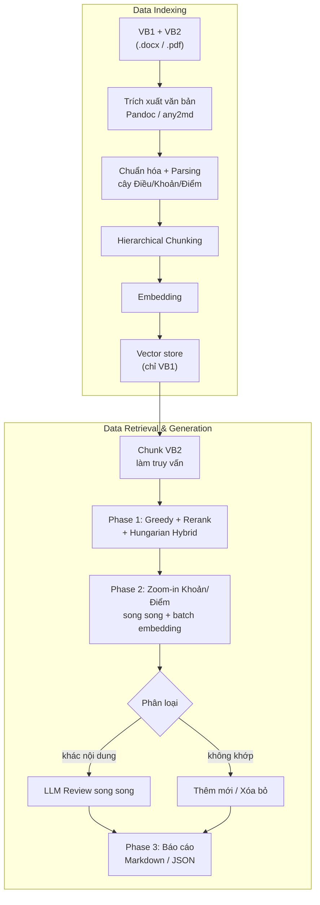
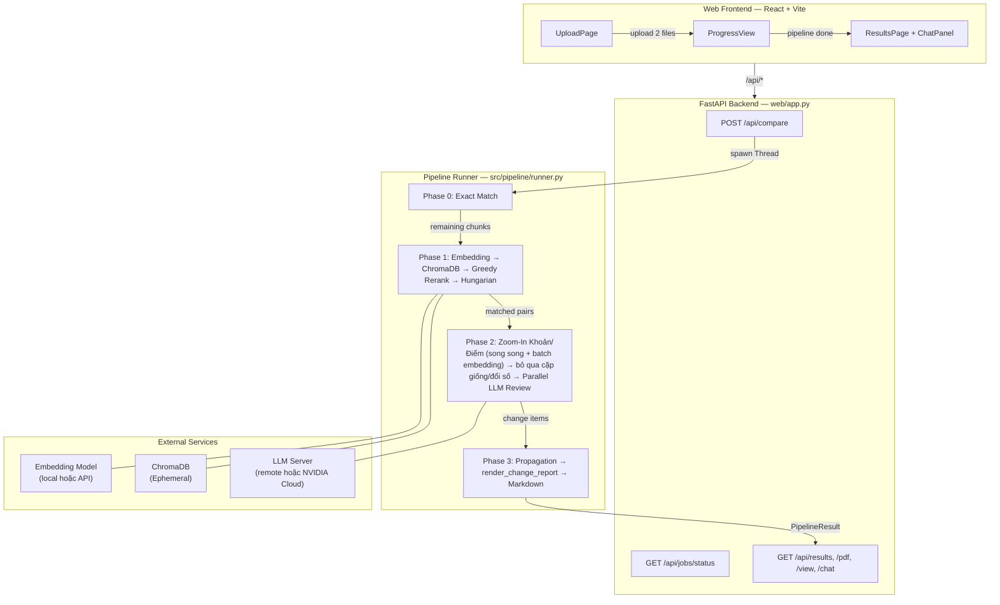

# Legal Doc Diff RAG

> Bài tập nhóm - Thực tập cơ sở - PTIT: NGHIÊN CỨU TRỢ LÝ SO SÁNH VĂN BẢN PHÁP LÝ CHẠY CỤC BỘ DÙNG RAG VÀ LOCAL LLM

Bài tập nhóm — Thực tập cơ sở — PTIT

Thành viên:

- Kiều Hồng Phong - B22DCKH084
- Lê Đình Đạt - B23DCKH021
- Nguyễn Đặng Long Vũ - B23DCKH133

---

## Mục lục

- [Tính năng chính](#tính-năng-chính)
- [Pipeline hệ thống](#pipeline-hệ-thống)
- [Tech Stack](#tech-stack)
- [Cấu trúc thư mục](#cấu-trúc-thư-mục)
- [Yêu cầu hệ thống](#yêu-cầu-hệ-thống)
- [Cài đặt](#cài-đặt)
- [Cấu hình Environment Variables](#cấu-hình-environment-variables)
- [Chạy Development](#chạy-development)
- [Chạy Pipeline qua CLI](#chạy-pipeline-qua-cli)
- [API Reference](#api-reference)
- [Architecture Overview](#architecture-overview)
- [Deployment Guide](#deployment-guide)

---

## Tính năng chính

- **Trích xuất văn bản hoàn toàn**: Hỗ trợ đầu vào `.docx` (Pandoc) và `.pdf` (any2md → Pandoc), tự động làm sạch HTML entities, chuẩn hóa dấu câu tiếng Việt, xử lý Unicode an toàn.
- **Phân tích cú pháp phân cấp hoàn chỉnh**: Dựng cây JSON cấu trúc pháp luật Việt Nam (`Điều → Khoản → Điểm`) bằng Regex tối ưu, kèm bóc tách tham chiếu chéo thông minh (xử lý được "Điều này", "Khoản 2 Điều này", v.v.).
- **Pipeline 4 Phase hoàn thiện & Zoom-In thông minh**:
  - **Phase 0** — So khớp text thô tuyệt đối (hash-based, instant, bỏ qua 100% các chunk giống nhau).
  - **Phase 1** — Embedding ngữ nghĩa + Greedy Rerank + Hungarian Hybrid Matching toàn cục cấp Điều (hỗ trợ cả API remote lẫn local model).
  - **Phase 2** — Progressive Zoom-In phân cấp chi tiết (Khoản → Điểm) **chạy song song** + **batch embedding**; xử lý riêng **Điều phẳng** (tách sửa/thêm/xóa); bỏ qua các cặp giống hệt hoặc chỉ khác đánh số; Parallel LLM Review (ThreadPoolExecutor 16 workers).
  - **Phase 3** — Kết xuất báo cáo Markdown / JSON chi tiết.
- **Tối ưu hóa Hiệu năng & Chi phí**:
  - **Thực thi LLM song song**: Chạy đồng thời tối đa 16 luồng (ThreadPoolExecutor max_workers=16), giúp tăng tốc độ xử lý gấp 10-15 lần.
  - **Song song hóa Zoom-In + Batch Embedding**: Ghép cặp Khoản/Điểm của mọi Điều chạy đồng thời, gộp embedding các sub-node trong một lời gọi API duy nhất, giảm khoảng 3 lần thời gian xử lý mỗi cặp văn bản.
  - **Bỏ qua so khớp tất định (không gọi LLM)**: Cặp giống hệt sau chuẩn hóa, hoặc chỉ khác tiền tố đánh số (kể cả đánh số đa cấp như `2.3` → `2.2`), được bỏ qua hoàn toàn.
- **Quản lý Cấu hình linh hoạt & Bảo mật**: Cấu hình YAML trung tâm + biến `.env`, hỗ trợ thay đổi `max_tokens`, `chunk_by`, cơ chế API key an toàn.

---

## Pipeline hệ thống



---

## Tech Stack

| Thành phần | Công nghệ |
|---|---|
| **Ngôn ngữ** | Python 3.13+, JavaScript (ES Module) |
| **Backend** | FastAPI, Uvicorn, Asyncio, `ThreadPoolExecutor` |
| **Frontend** | React 19, Vite 8, TailwindCSS v4 |
| **Embedding** | SentenceTransformer (`Vietnamese_Embedding_v2`), hỗ trợ ONNX Runtime GPU |
| **Reranker** | FlagEmbedding (`Vietnamese_Reranker`) |
| **Vector DB** | ChromaDB (Ephemeral / Persistent) |
| **LLM** | LLM (remote, NVIDIA API Cloud) |
| **Matching** | Hungarian Algorithm (`scipy.optimize.linear_sum_assignment`), Hybrid Scoring (Cosine + Jaccard + Positional Bias + Title Fuzzy) |
| **Document Parsing** | Pandoc (`pypandoc`), `any2md`, `python-docx` |
| **PDF Export** | WeasyPrint (ưu tiên), fallback `xhtml2pdf` |
| **Package Manager & Utilities** | `uv` (Python), `npm` (Frontend), `localtunnel` (Expose Local Host) |

---

## Cấu trúc thư mục

```
TTCS/
├── .env                          # Biến môi trường (git-ignored)
├── .env.example                  # Template biến môi trường
├── pyproject.toml                # uv: dependencies, Python version
├── requirements.txt              # pip: pinned dependencies (CUDA 13.0)
├── main.py                       # Entry point placeholder
│
├── configs/
│   └── config.yaml               # Cấu hình trung tâm (paths, thresholds, LLM, embedding, web)
│
├── src/                          # Source code chính
│   ├── config.py                 # Load .env + config.yaml → hằng số toàn cục
│   ├── schemas.py                # Pydantic/Dataclass models dùng chung
│   │
│   ├── core/
│   │   ├── ingestion/            # Trích xuất & làm sạch văn bản
│   │   │   ├── extractor.py      # Dispatcher: detect .docx/.pdf → gọi extractor tương ứng
│   │   │   ├── docx_extractor.py # DOCX → Pandoc HTML → plain text
│   │   │   ├── pdf_extractor.py  # PDF → any2md → Markdown → Pandoc HTML → plain text
│   │   │   └── text_cleaner.py   # Loại bỏ HTML tags, chuẩn hóa Unicode/dấu câu tiếng Việt
│   │   │
│   │   ├── chunker/              # Phân tích cú pháp & chunking
│   │   │   ├── legal_parser.py   # build_json_tree: Regex → cây JSON (Điều/Khoản/Điểm)
│   │   │   ├── hierarchical.py   # HierarchicalChunker + build_node_registry (O(N) bottom-up)
│   │   │   ├── fixed_size.py     # Chunker theo token cố định + overlap
│   │   │   └── factory.py        # ChunkerFactory
│   │   │
│   │   ├── embedding/            # Module nhúng vector
│   │   │   ├── __init__.py       # decode_section_id utility
│   │   │   ├── embedding.py      # EmbeddingPipeline: chunk → EmbeddingRequest
│   │   │   ├── embedding_model.py  # SentenceTransformer wrapper (CPU/GPU auto)
│   │   │   └── onnx_embedding.py # ONNX Runtime embedding (legacy)
│   │   │
│   │   ├── vector_store/         # Lưu trữ vector
│   │   │   ├── chroma_store.py   # ChromaDB wrapper (upsert, query, batch)
│   │   │   └── vectorstore.py    # VectorStorePipeline: EmbeddingResult → ChromaDB
│   │   │
│   │   ├── retrieval/            # Truy vấn & rerank
│   │   │   └── retrieval.py      # RetrievalService: embed → query → rerank
│   │   │
│   │   ├── matching/             # So khớp & phân tích LLM
│   │   │   ├── matcher.py        # build_global_matches (Pass 1 Greedy + Pass 2 Hungarian)
│   │   │   │                     # match_sub_nodes (embedding cho Khoản/Điểm + ghép lại phần dư, hỗ trợ embed_cache)
│   │   │   ├── scoring.py        # calculate_hybrid_score, Jaccard, title similarity
│   │   │   ├── llm_review.py     # call_local_llm, llm_review_pair/dieu_flat/single/khoan_with_diem
│   │   │   ├── llm_prompts.py    # System/User prompt templates cho LLM
│   │   │   ├── chunk_formatter.py  # format_chunk cho LLM và exact match
│   │   │   └── reporting.py      # render_change_report → Markdown báo cáo
│   │   │
│   │   └── api/                  # Client gọi API external
│   │       └── call_api.py       # call_embed_api, call_rerank_api, call_generate_api
│   │
│   └── pipeline/
│       └── runner.py             # run_pipeline: điều phối 4 Phase đầu-cuối + CLI
│
├── web/                          # Web application
│   ├── app.py                    # FastAPI backend (REST API)
│   ├── chat.py                   # Chat hỏi đáp về báo cáo qua LLM
│   └── frontend/                 # React SPA
│       ├── package.json          # React 19 + Vite 8 + TailwindCSS v4
│       ├── vite.config.js        # Dev proxy → backend :8080
│       └── src/
│           ├── App.jsx           # Router: Upload → Progress → Results
│           ├── api.js            # API client (fetch)
│           └── components/
│               ├── UploadPage.jsx     # Upload 2 file .docx/.pdf
│               ├── ProgressView.jsx   # Theo dõi tiến trình pipeline
│               ├── ResultsPage.jsx    # Hiển thị kết quả phân tích
│               ├── StatsCards.jsx     # Thẻ thống kê tổng quan
│               ├── ChangeList.jsx     # Danh sách thay đổi chi tiết
│               ├── SideBySideView.jsx # Xem song song 2 văn bản
│               ├── ChatPanel.jsx      # Chat hỏi đáp về kết quả
│               └── FloatingTimer.jsx  # Bộ đếm thời gian nổi theo thời gian thực (Floating Timer)
│
├── models/                       # Trọng số mô hình (git-ignored)
│   ├── Vietnamese_Embedding_v2/  # SentenceTransformer embedding model
│   └── Vietnamese_Reranker/      # FlagEmbedding reranker model (tùy chọn)
│
├── data/                         # Dữ liệu ChromaDB (git-ignored)
├── docs/
│   ├── setup.md                  # Hướng dẫn cài đặt chi tiết
│   └── images/
│       └── PipelineTTCS.png      # Sơ đồ pipeline
│
├── notebooks/                    # Jupyter notebooks thử nghiệm
└── system_pipeline_walkthrough.md  # Tài liệu kiến trúc chi tiết
```

---

## Yêu cầu hệ thống

| Thành phần | Yêu cầu |
|---|---|
| Python | 3.13+ |
| Node.js | 20+ |
| RAM | 8GB+ |
| GPU | NVIDIA GPU với CUDA 13.0 (khuyến nghị, không bắt buộc — chạy được trên CPU) |
| Pandoc | Cài đặt hệ thống (`pandoc`) |
| Hệ điều hành | Windows / Linux |

---

## Cài đặt

### 1. Clone repository

```bash
git clone https://github.com/<your-org>/legal-doc-diff-rag.git
cd legal-doc-diff-rag
```

### 2. Cài thư viện hệ thống

**Linux:**
```bash
sudo apt update && sudo apt install -y pandoc libpango-1.0-0 libpangoft2-1.0-0 libharfbuzz-subset0
```

**Windows:**
- Cài [Pandoc](https://pandoc.org/installing.html) và thêm vào PATH.

### 3. Cài Python dependencies

**Dùng `uv` (khuyến nghị):**
```bash
uv sync
```

**Hoặc dùng `pip`:**
```bash
python -m venv .venv
# Windows:
.venv\Scripts\activate
# Linux:
source .venv/bin/activate

pip install --upgrade pip
pip install -r requirements.txt
```

### 4. Cài Frontend dependencies

```bash
cd web/frontend
npm install
cd ../..
```

### 5. Tải mô hình AI

Đặt các mô hình vào thư mục `models/`:

| Mô hình | Đường dẫn | Mô tả |
|---|---|---|
| Vietnamese Embedding v2 | `models/Vietnamese_Embedding_v2/` | SentenceTransformer embedding cho tiếng Việt |
| Vietnamese Reranker | `models/Vietnamese_Reranker/` | Cross-encoder reranker (tùy chọn, có DummyReranker fallback) |

### 6. Cấu hình môi trường

**Linux / macOS:**
```bash
cp .env.example .env
```

**Windows (PowerShell):**
```powershell
Copy-Item .env.example .env
```

Sau đó chỉnh sửa file `.env` theo hướng dẫn bên dưới.

---

## Cấu hình Environment Variables

File `.env` (hoặc ghi đè qua biến môi trường hệ thống):

```env
## ENDPOINT — Chạy gộp 1 máy chủ:
API_BASE_URL=http://localhost:8080

## Hoặc tách riêng từng server:
# EMBED_API_URL=http://localhost:8000
# RERANK_API_URL=http://localhost:8080
# LLM_API_URL=http://localhost:8002

## CHẾ ĐỘ LLM
# "nvidia" — Gọi LLM qua NVIDIA API (mặc định hiện tại)
# "remote" — Gọi qua LLM tự host (server expose /generate)
LLM_MODE=nvidia
LLM_MODEL_NAME=qwen/qwen3-next-80b-a3b-instruct
LLM_API_KEY=<nvidia_api_key>
```

Tất cả cấu hình còn có thể đặt trong `configs/config.yaml` với các nhóm: `paths`, `pipeline_thresholds`, `llm`, `embedding`, `web`. Biến `.env` sẽ **ghi đè** giá trị trong YAML.

**Các threshold quan trọng** (trong `config.yaml` hoặc `.env`):

| Biến | Mặc định | Mô tả |
|---|---|---|
| `TOP_K` | `8` | Số ứng viên tối đa lấy từ ChromaDB |
| `DISTANCE_THRESHOLD` | `0.185` | Ngưỡng khoảng cách tối đa (Greedy Match) |
| `RERANK_THRESHOLD` | `0.98` | Ngưỡng reranker khớp nhanh |
| `HYBRID_THRESHOLD` | `0.65` | Ngưỡng Hungarian Hybrid tối thiểu |

---

## Chạy Development

Cần **3 terminal** chạy song song:

### Terminal 1 — LLM Server

Chạy LLM phía hosting — bất kỳ server nào expose `/embed`, `/rerank`, `/generate` endpoints.

### Terminal 2 — Backend (FastAPI)

**Linux / macOS:**
```bash
uvicorn web.app:app --host 0.0.0.0 --port 8080 --reload --reload-dir src --reload-exclude "web/frontend/*"
```

**Windows (PowerShell):**
```powershell
uvicorn web.app:app --host 0.0.0.0 --port 8080 --reload --reload-dir src --reload-exclude "web/frontend/*"
```

### Terminal 3 — Frontend (Vite)

**Linux / macOS:**
```bash
cd web/frontend
npm run dev
```

**Windows (PowerShell):**
```powershell
cd web\frontend
npm run dev
```

Mở trình duyệt tại `http://localhost:5173`.

> **Lưu ý**: Vite proxy tự động chuyển tiếp `/api/*` tới backend tại `http://127.0.0.1:8080` (cấu hình trong `vite.config.js`).

---

## Chạy Pipeline qua CLI

```bash
python -m src.pipeline.runner --vb1 path/to/old.docx --vb2 path/to/new.docx
```

Nếu không truyền tham số, pipeline sẽ đọc đường dẫn mặc định từ `config.yaml` (`vb1.docx`, `vb2.docx`).

---

## API Reference

Backend chạy tại `http://localhost:8080`. Swagger UI: `http://localhost:8080/docs`.

### `POST /api/compare`

Upload 2 file để bắt đầu so sánh. Trả về `job_id` ngay lập tức, pipeline chạy nền (async thread).

```
Content-Type: multipart/form-data
Fields: vb1 (file), vb2 (file)
Accepted: .docx, .pdf (tối đa 20MB)
```

**Response:**
```json
{ "job_id": "a1b2c3d4e5f6" }
```

### `GET /api/jobs/{job_id}/status`

Theo dõi tiến trình pipeline.

**Response:**
```json
{
  "job_id": "a1b2c3d4e5f6",
  "status": "running",       // "pending" | "running" | "done" | "error"
  "phase": "phase_2",        // "loading" | "phase_0" | "phase_1" | "phase_2" | "done"
  "message": "Phase 2: LLM phân tích các cặp thay đổi...",
  "error": ""
}
```

### `GET /api/jobs/{job_id}/results`

Lấy kết quả phân tích (chỉ khi `status=done`).

**Response chứa:**
- `stats` — Thống kê: số chunk VB1/VB2, giống hoàn toàn, sửa đổi, thêm mới, xóa bỏ.
- `matched_pairs` — Danh sách các cặp chunk đã ghép.
- `changes` — Thay đổi phân nhóm (`sua_doi`, `them_moi`, `xoa_bo`).
- `report_text` — Báo cáo Markdown đầy đủ.

### `GET /api/jobs/{job_id}/pdf/{doc}`

Trả file dưới dạng PDF (`doc` = `vb1` hoặc `vb2`). Tự động convert DOCX → PDF.

### `GET /api/jobs/{job_id}/view/{doc}`

Trả file dưới dạng HTML để nhúng iframe.

### `GET /api/jobs/{job_id}/file/{doc}`

Tải file gốc.

### `POST /api/jobs/{job_id}/chat`

Chat hỏi đáp về kết quả phân tích.

```json
{ "question": "Điều nào có thay đổi lớn nhất?" }
```

**Response:**
```json
{ "answer": "Điều 5 có thay đổi lớn nhất với việc..." }
```

---

## Architecture Overview



### Luồng xử lý chi tiết

1. **Ingestion**: `extract_file()` → detect `.docx`/`.pdf` → Pandoc HTML → `extract_text_from_html()` → plain text.
2. **Parsing**: `build_json_tree()` → cây JSON phân cấp (Điều/Khoản/Điểm) với tham chiếu chéo.
3. **Registry**: `build_node_registry()` — duyệt hậu thứ tự O(N), cache `cached_merged_text` và `cached_keywords` cho mỗi node.
4. **Chunking**: `HierarchicalChunker(chunk_by="dieu" hoặc "khoan")` — trích xuất chunk pháp lý theo cấu hình tùy chọn (mặc định cấp Điều, tự động fallback khi vượt `max_tokens`).
5. **Phase 0**: So sánh chuỗi text thô → lọc bỏ hoàn toàn các Điều giống nhau 100%.
6. **Phase 1**: Embedding mô hình nhúng → ChromaDB index → Pass 1 (Greedy top-K + Rerank) → Pass 2 (Hungarian Hybrid Matrix) toàn cục ở cấp Điều.
7. **Phase 2**: Zoom-In phân cấp sâu (Điều → Khoản → Điểm), chạy **song song** trên nhiều luồng và **gộp embedding theo lô**; bỏ qua các cặp giống hệt hoặc chỉ khác đánh số (kể cả đa cấp); Điều phẳng được xử lý riêng để tách sửa/thêm/xóa; các cặp khác biệt còn lại gọi **LLM Review song song** (tối đa 16 workers) với prompt báo cáo vị trí cụ thể.
8. **Propagation & Reporting**: Lan truyền trạng thái thay đổi lên nút cha, gộp các `ChangeItem` trùng → `render_change_report()` → kết xuất báo cáo Markdown / JSON và đồng bộ giao diện.

> 📖 Xem chi tiết tại [system_pipeline_walkthrough.md](system_pipeline_walkthrough.md)

---

## Deployment Guide

### Deploy trên server (GPU)

**Linux:**
```bash
# 1. Cài đặt theo phần "Cài đặt" ở trên

# 2. Chạy LLM server phía hosting

# 3. Chạy backend
uvicorn web.app:app --host 0.0.0.0 --port 8080 &

# 4. Build frontend production
cd web/frontend
npm run build
# Serve static files bằng nginx hoặc tương tự
```

**Windows (PowerShell):**
```powershell
# 1. Cài đặt theo phần "Cài đặt" ở trên

# 2. Chạy LLM server phía hosting

# 3. Chạy backend
Start-Process uvicorn -ArgumentList "web.app:app", "--host", "0.0.0.0", "--port", "8080"

# 4. Build frontend production
cd web\frontend
npm run build
```

### Expose qua Cloudflare Tunnel

Backend và Frontend đã hỗ trợ sẵn CORS cho domain `*.trycloudflare.com`. Cập nhật:
- `web/app.py` → `allow_origins` — thêm domain tunnel.
- `web/frontend/vite.config.js` → `allowedHosts` — thêm domain tunnel FE.

### Tách riêng máy chủ AI

Cấu hình `.env` để trỏ Embedding, Reranker, LLM đến các máy chủ khác nhau:

```env
EMBED_API_URL=http://gpu-server-1:8000
RERANK_API_URL=http://gpu-server-1:8080
LLM_API_URL=http://gpu-server-2:11434
```

API external cần expose 3 endpoint: `POST /embed`, `POST /rerank`, `POST /generate`.

---

## Kiến Trúc Kỹ Thuật & Thực Hiện (Technical Details)

### Registry & Caching Strategy

Hệ thống sử dụng Registry dạng từ điển (`dict`) để lưu trữ các node của cây pháp luật phẳng, ánh xạ từ ID duy nhất (ví dụ: `"dieu_6.khoan_2.diem_a"`) đến node metadata. Mỗi node được tính toán sẵn (cached) hai thông tin quan trọng:

- **`cached_merged_text`**: Nội dung gộp của node cùng toàn bộ con trực tiếp (sử dụng trong LLM context).
- **`cached_keywords`**: Tập từ khóa Jaccard của node (sử dụng trong Lexical Safeguard).

Quá trình tính toán này chỉ diễn ra **một lần duy nhất** khi load chunk, sử dụng duyệt hậu-thứ tự (post-order traversal), độ phức tạp $O(N)$.

### Parallel LLM Review

Thay vì gọi LLM tuần tự cho từng Khoản/Điểm thay đổi (tốn 50-100 giây cho 100 điều khoản), hệ thống:

1. Thu thập tất cả các tác vụ cần review LLM (điều khoản sửa, khoản mới, điểm mới).
2. Tạo danh sách callable: `[llm_review_pair(dieu_pair), llm_review_single(khoan_moi), ...]`
3. Gửi tối đa **16 tác vụ đồng loạt** qua `ThreadPoolExecutor` với timeout `LLM_REMOTE_TIMEOUT = 180s` mỗi tác vụ.
4. Khi từng tác vụ hoàn thành, hệ thống lập tức xử lý kết quả và cập nhật giao diện (streaming).

Kết quả: tốc độ tăng từ **~100 giây xuống ~10-15 giây** cho 100 điều khoản.

### Lexical Safeguard & Numbering Detection

**Lexical Safeguard**: Nếu so sánh Jaccard trên tập từ khóa pháp lý (số, ngày, từ phủ định/bắt buộc như "không", "phải", "được", "cấm") đạt 1.0 (không biến động), tác vụ LLM sẽ bị bỏ qua.

**Numbering-only Diff**: Nếu nội dung của một Khoản giữ nguyên 100% (sau loại bỏ tiền tố thứ tự bằng Regex `^[\s]*(?:điều|khoản|mục|chương|điểm|phần)?[\s]*(?:[0-9]{1,2}|[a-z])[\s]*[.):\-]*\s*`), nhưng chỉ số thay đổi (ví dụ: "2. ..." thành "3. ..."), hệ thống tự động sinh `ChangeItem` với `method="automatic_numbering_diff"` mà **không gọi LLM**.

---

## Tài liệu bổ sung

- [System Pipeline Walkthrough](docs/system_pipeline_walkthrough.md) — Tài liệu kiến trúc & luồng xử lý 4 Phase hoàn chỉnh với code example
