# Hệ thống So sánh Văn bản Pháp luật — Kiến trúc & Tổng hợp Thay đổi

> Tài liệu mô tả kiến trúc hiện tại của pipeline so sánh hai phiên bản văn bản pháp luật (VB1 cũ ↔ VB2 mới), cùng toàn bộ các fix/cải tiến đã thực hiện và kết quả kiểm thử.

---

## 1. Tổng quan

Hệ thống nhận **hai phiên bản** của một văn bản (hợp đồng, nghị định...) và tự động phát hiện, phân loại các thay đổi:

| Nhóm | Ý nghĩa |
|------|---------|
| `giong_nhau_hoan_toan` | Giống hệt (kể cả chỉ khác cách đánh số / paraphrase mà LLM coi là không đổi nghĩa) |
| `sua_doi` | Sửa đổi nội dung (đổi quyền/nghĩa vụ/số liệu...) |
| `them_moi` | Thêm mới ở VB2 |
| `xoa_bo` | Xóa khỏi VB1 |

**Kết quả** đi qua FastAPI → React frontend (tabs + side-by-side PDF + chat).

### Công nghệ
- **Embedding**: ONNX `Vietnamese_Embedding_v2` (local) hoặc API (`localhost:8001`)
- **Reranker**: `Vietnamese_Reranker` (local) hoặc API
- **Vector store**: ChromaDB (in-memory, tạo mới mỗi lần chạy)
- **LLM**: qwen3-next-80b (NVIDIA API) hoặc remote/Ollama — phân tích & tóm tắt thay đổi
- **Matching**: Greedy (vector+rerank) + Hungarian (scipy `linear_sum_assignment`)

---

## 2. Kiến trúc Pipeline (5 Phase)

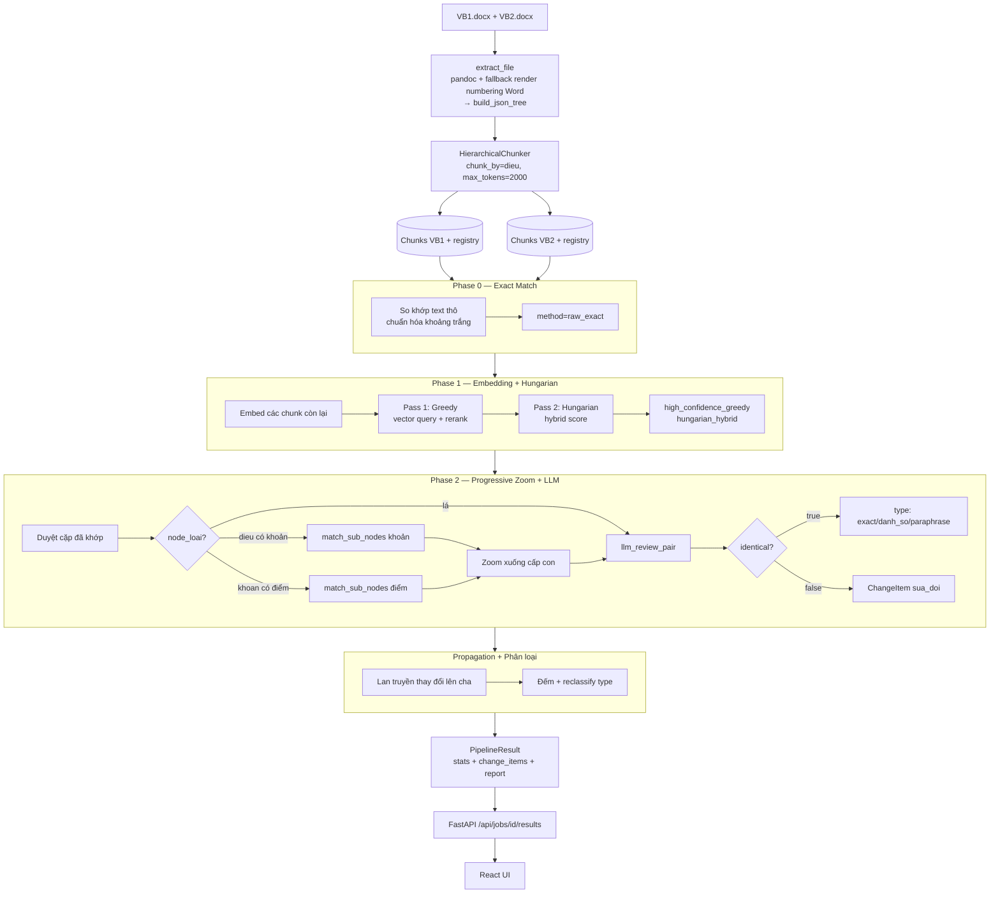

### Ngưỡng cấu hình ([configs/config.yaml](../configs/config.yaml))

| Tham số | Giá trị | Vai trò |
|---------|---------|---------|
| `max_tokens` | **2000** | Giới hạn token mỗi chunk (sát giới hạn embedding 2048) |
| `chunk_by` | `dieu` | Cấp chunk gốc |
| `distance_threshold` | 0.185 | Ngưỡng vector cho Greedy |
| `rerank_threshold` | 0.98 | Ngưỡng rerank cho Greedy |
| `hybrid_threshold` | 0.65 | Ngưỡng Hungarian chấp nhận khớp |

---

## 3. Module `src/core/matching`

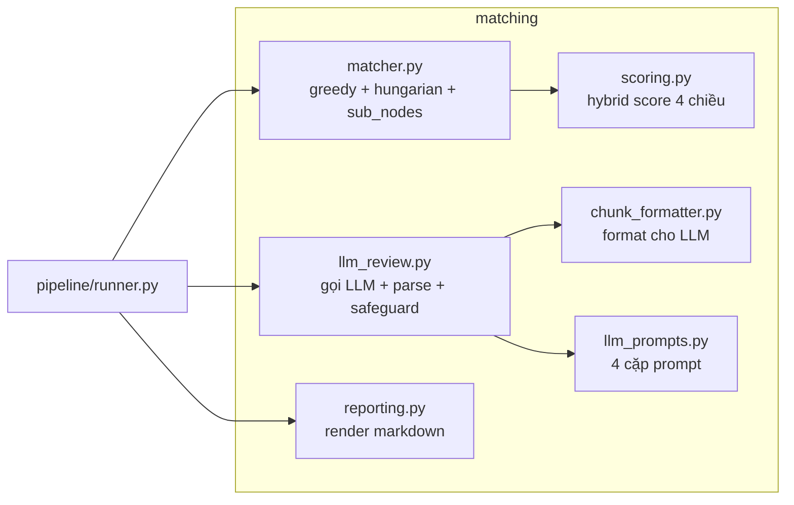

### 3.1. `scoring.py` — Hybrid Score

```
score = 0.35·s_embed + 0.15·s_title + 0.20·s_pos + 0.30·s_lex
        (nếu thiếu title: 0.50·s_embed + 0.20·s_pos + 0.30·s_lex)
```
- `s_embed`: cosine similarity vector
- `s_title`: fuzzy token-sort tên tiêu đề
- `s_pos`: tương đồng vị trí trong văn bản
- `s_lex`: Jaccard từ khóa (số, ngày, tên riêng)

### 3.2. `matcher.py`

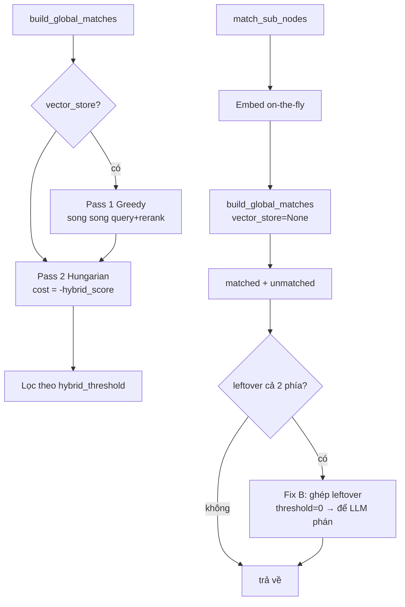

### 3.3. `llm_review.py` — luồng `llm_review_pair`

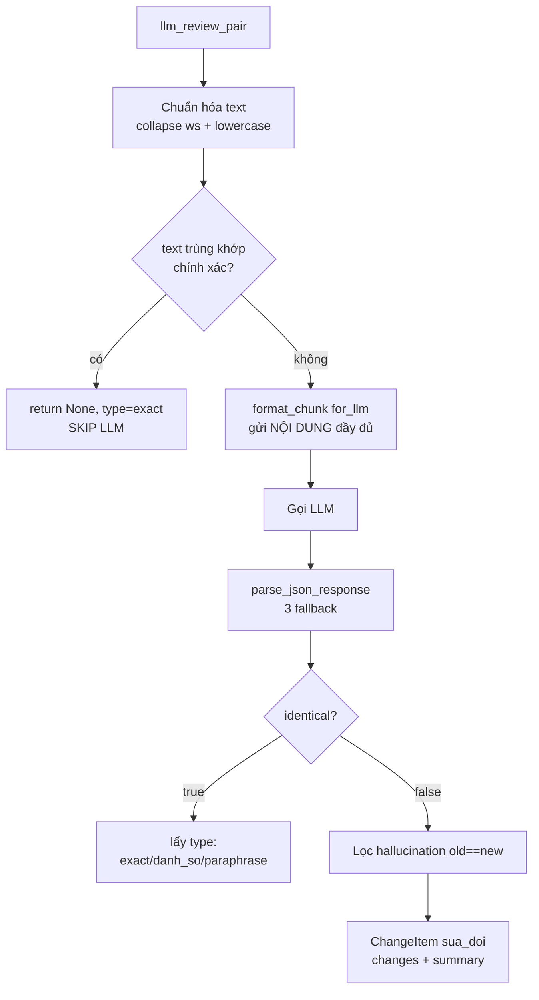

### 3.4. Bốn cặp prompt ([llm_prompts.py](../src/core/matching/llm_prompts.py))
- `PAIR_REVIEW_*`: so sánh cặp đã khớp → `identical` + `type` + `changes`
- `SINGLE_REVIEW_*`: tóm tắt chunk thêm/xóa đơn lẻ
- `KHOAN_WITH_DIEM_*`: phân tích Khoản kèm các Điểm con

---

## 4. Phân loại thay đổi (Taxonomy)

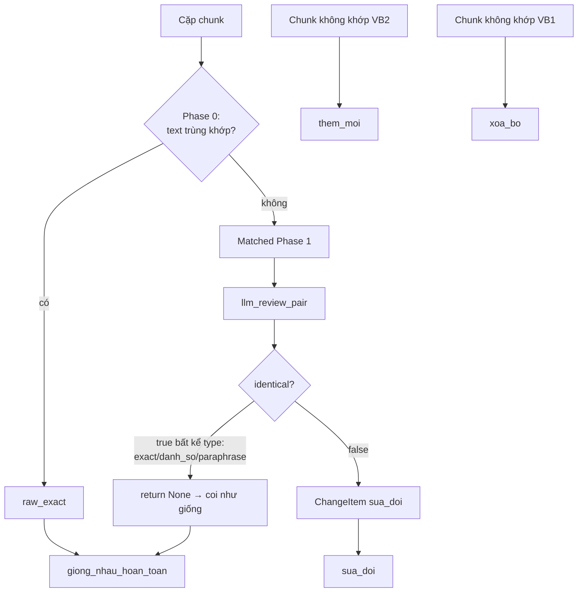

> **Thống nhất 3 nơi**: cả `runner.py` (report + stats) và `web/app.py` (UI) đều dùng `{llm_semantic_identical}` cho `giong_nhau_ngu_nghia` (trước đây lệch nhau).

---

## 5. Tổng hợp các Fix & Cải tiến (phiên này)

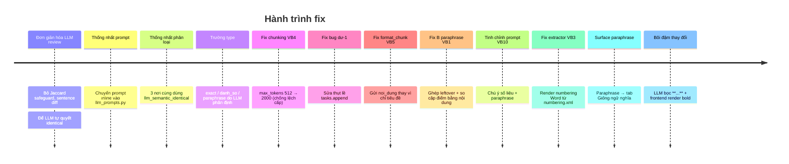

### 5.1. Bảng tổng hợp

| # | Fix | File | Vấn đề giải quyết |
|---|-----|------|-------------------|
| 1 | Đơn giản hóa `llm_review_pair` | [llm_review.py](../src/core/matching/llm_review.py) | Bỏ `get_critical_tokens`, `check_lexical_safeguard_jaccard`, `split_into_sentences_or_bullets`; để LLM quyết `identical` |
| 2 | Gom prompt | [llm_prompts.py](../src/core/matching/llm_prompts.py) | Prompt inline của `khoan_with_diem` chuyển vào file prompt |
| 3 | Thống nhất `giong_nhau_ngu_nghia` | [runner.py](../src/pipeline/runner.py), [web/app.py](../web/app.py) | 3 định nghĩa lệch nhau → cùng `{llm_semantic_identical}` |
| 4 | Trường `type` | [llm_prompts.py](../src/core/matching/llm_prompts.py), [llm_review.py](../src/core/matching/llm_review.py), [runner.py](../src/pipeline/runner.py) | LLM phân định exact / danh_so / paraphrase → tách "chỉ khác đánh số" khỏi paraphrase |
| 5 | **Chunking max_tokens 512→2000** | [config.yaml](../configs/config.yaml) | Cùng một Điều bị tách khoản ở bản này, giữ nguyên ở bản kia → matcher lệch cấp |
| 6 | **Fix bug "dư-1"** | [runner.py](../src/pipeline/runner.py) | `tasks.append` nằm NGOÀI vòng `for` → `chunk_d1` rò rỉ giữa các vòng → xóa_bo ma |
| 7 | **Fix `format_chunk`** | [chunk_formatter.py](../src/core/matching/chunk_formatter.py) | `for_llm=True` chỉ gửi `tieu_de` (tiêu đề) → mất thân → LLM tưởng giống nhau |
| 8 | **Fix B — paraphrase recall** | [matcher.py](../src/core/matching/matcher.py), [runner.py](../src/pipeline/runner.py) | Cặp điểm paraphrase bị ngưỡng loại → tách thành xóa+thêm |
| 9 | Tinh chỉnh prompt | [llm_prompts.py](../src/core/matching/llm_prompts.py) | Chú ý thay đổi nhỏ (phủ định/số/tình thái) + trích số liệu chính xác |
| 10 | **Fix extractor — render numbering Word** | [docx_extractor.py](../src/core/ingestion/docx_extractor.py) | Văn bản dùng numbered-list tự động của Word → pandoc làm mất số "Điều N" → parser không tách được Điều |
| 11 | ~~Surface paraphrase → ngu_nghia~~ **(ĐÃ GỠ)** | llm_review.py, runner.py, FE | Thử tách paraphrase ra tab riêng, nhưng LLM (qwen) phán nhầm thay đổi thật (vd xóa 1 câu) là "giống nghĩa" → GIẤU thay đổi. Đã gỡ tab "Giống ngữ nghĩa": mọi cặp LLM coi là giống đều bỏ qua, không tách riêng |
| 12 | **Bôi đậm từ thay đổi** | [llm_prompts.py](../src/core/matching/llm_prompts.py), [ResultsPage.jsx](../web/frontend/src/components/ResultsPage.jsx) | LLM bọc từ thay đổi bằng `**...**`; frontend `renderRich` render `<strong>` tô nổi bật |

### 5.2. Chi tiết 3 fix quan trọng nhất

#### Fix #5 — Chunking lệch cấp (phát hiện ở VB4)
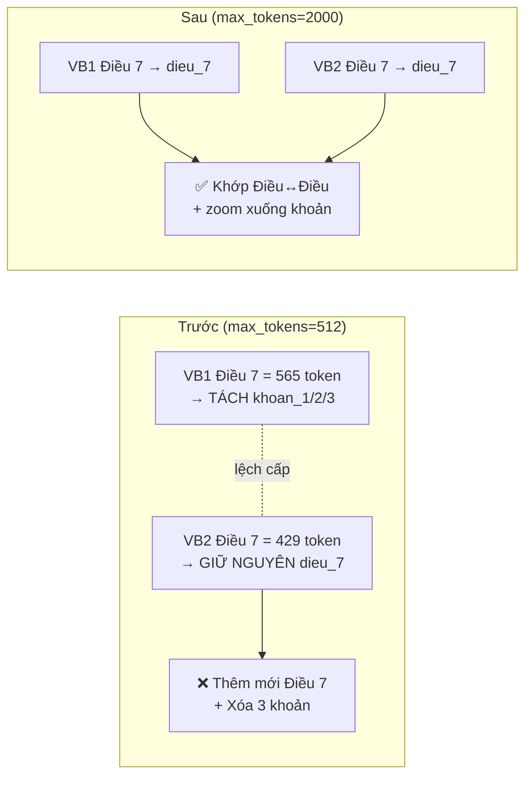
Điều > 2000 token (vd Điều 2: 2124/2253) vẫn tách khoản ở **cả hai** → đối xứng. Phase 2 vẫn zoom xuống khoản/điểm qua registry nên không mất độ chi tiết.

#### Fix #6 — Bug "dư-1" (thụt lề)
```python
# TRƯỚC (sai): tasks.append NGOÀI vòng for
for d1 in unmatched_diem_1:
    chunk_d1 = ChunkDocumentForHierarchical(...)   # ← bị overwrite/rò rỉ
tasks.append({"args": (chunk_d1, "xoa_bo"), ...})  # ← chạy 1 lần với chunk_d1 còn sót

# SAU (đúng): tasks.append TRONG vòng for
for d1 in unmatched_diem_1:
    chunk_d1 = ChunkDocumentForHierarchical(...)
    tasks.append({"args": (chunk_d1, "xoa_bo"), ...})
```
Khi `unmatched_diem_1` rỗng, dòng `tasks.append` cũ vẫn chạy với `chunk_d1` của vòng lặp trước → sinh `xoa_bo` ma (vd "Xóa điểm d Điều 2" với `VB2=dieu_5`).

#### Fix #7 — `format_chunk` nuốt nội dung (phát hiện ở VB5)
```python
# TRƯỚC: ưu tiên tieu_de (chỉ là "Điều 3. PHÍ DỊCH VỤ...") → mất bảng phí
noi_dung = chunk.tieu_de or chunk.noi_dung or "(trống)"
# SAU: ưu tiên noi_dung (thân đầy đủ)
noi_dung = chunk.noi_dung or chunk.tieu_de or "(trống)"
```
LLM trước đây chỉ nhận tiêu đề (giống nhau ở 2 bản) → phán "identical" → bỏ sót mọi thay đổi trong thân Điều phẳng.

#### Fix #8 — Fix B (paraphrase, phát hiện ở VB1)
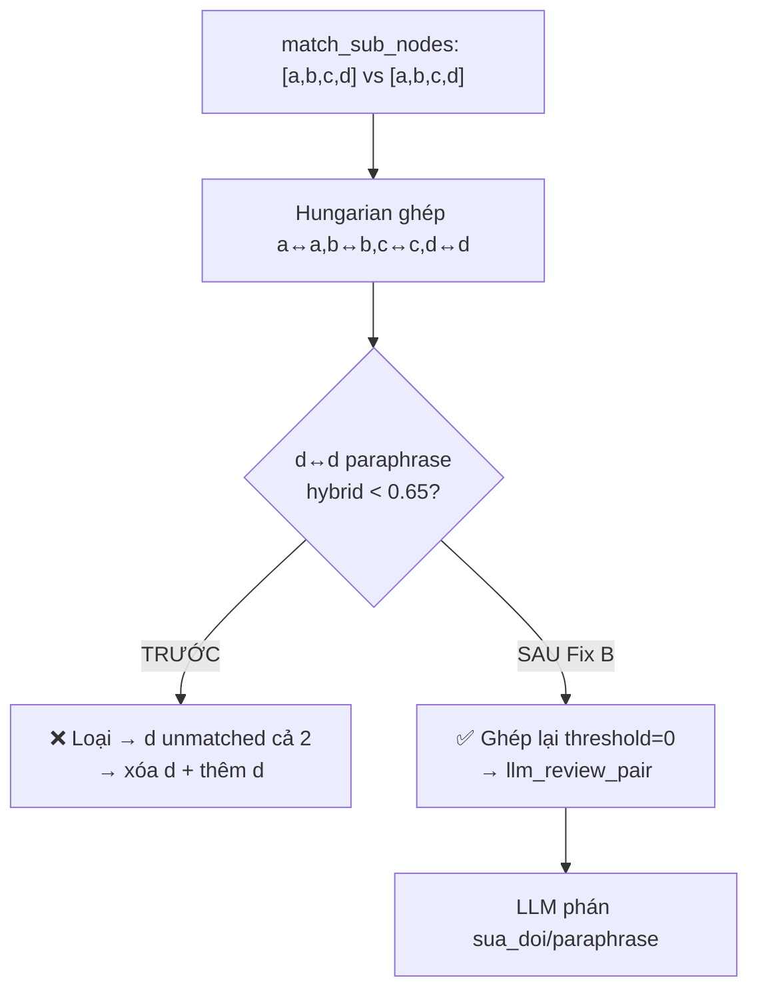
Đồng thời sửa runner: so cặp điểm đã khớp bằng **nội dung** (`cached_merged_text`), không phải `tieu_de` (với điểm chỉ là nhãn "Điểm a").

#### Fix #10 — Render numbering Word (phát hiện ở VB3)
Một số .docx đánh số "Điều 1, 2..." bằng **numbered-list tự động của Word** — số không nằm trong text mà do Word sinh khi hiển thị. Khi `docx → pandoc HTML → text`, số bị mất; parser không thấy "Điều N" → gom cả văn bản thành `modau_* + dieu_kho`.

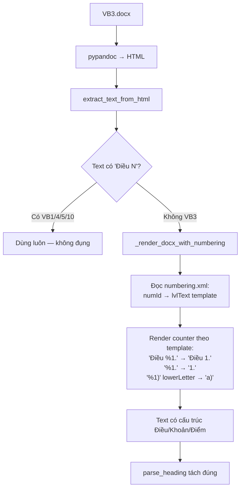

Cơ chế **fallback** (chỉ chạy khi text pandoc thiếu "Điều N") nên không ảnh hưởng các văn bản đang chạy tốt. Kết quả: VB3 từ 4 chunk dị thường (`dieu_kho`) → đúng `dieu_1..9`, phát hiện **9/9** thay đổi.

#### Fix #11 — Surface paraphrase vào tab "Giống ngữ nghĩa" — ⚠️ ĐÃ GỠ
> **Đã gỡ bỏ** theo quyết định của người dùng: qwen phán nhầm thay đổi thật (vd xóa 1 câu thông báo điện thoại ở VB2) là "giống nghĩa" → giấu mất thay đổi. Tab "Giống ngữ nghĩa" bị bỏ hoàn toàn; mọi cặp LLM coi là giống → bỏ qua. Mô tả dưới đây giữ lại để tham khảo thiết kế.

Trước đây cặp con (khoản/điểm) được LLM phán `identical + type=paraphrase` → `llm_review_pair` trả `None` → callback **vứt bỏ** → biến mất khỏi mọi tab.

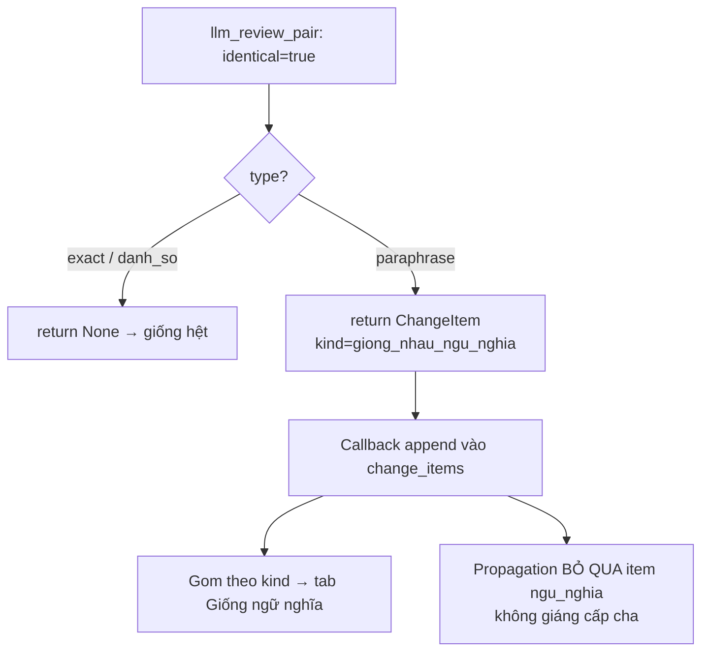

Kèm example paraphrase trong prompt để qwen chịu phát `type=paraphrase`. Kết quả: VB1 `dieu_21.khoan_3.diem_a` (gt #9) vào đúng tab (trước bị drop); không mất detection, không regress VB3/4/10.

#### Fix #12 — Bôi đậm từ/cụm từ thay đổi
Prompt yêu cầu LLM bọc phần thay đổi trong `old_content`/`new_content` bằng `**...**`. Frontend [ResultsPage.jsx](../web/frontend/src/components/ResultsPage.jsx) có helper `renderRich` tách `**...**` → `<strong>` tô xanh.

```
Cũ: ...mỗi ngày chậm thanh toán phải chịu **1%** giá trị...
Mới: ...mỗi ngày chậm thanh toán phải chịu **0,05%** giá trị...
```
Giúp người đọc thấy ngay chỗ khác biệt (số liệu, phủ định, động từ tình thái).

---

## 6. Kết quả Kiểm thử (4 bộ văn bản, qwen3-80b)

| Bộ | Loại | Trước fix | Sau fix | Groundtruth |
|----|------|-----------|---------|-------------|
| **VB4** | Hợp đồng mua bán điện | Điều 7/8 sai hoàn toàn | **9/9** ✓ | 3 sửa / 2 thêm / 4 xóa |
| **VB1** | Hợp đồng tư vấn | 1 sửa, paraphrase tách xóa+thêm | **5 sửa / 1 thêm / 1 xóa** | nhiều paraphrase |
| **VB5** | Hợp đồng SEO | 0–1 (chỉ tiêu đề) | **3 sửa đúng** | cấu trúc phẳng |
| **VB10** | Hợp đồng xây dựng | 5/9 (eval cũ) | **9/9 phát hiện** ✓ | 6 sửa / 1 thêm / 1 xóa / 1 paraphrase |
| **VB3** | Hợp đồng thế chấp | 6/9, chunking sai (`dieu_kho`) | **9/9** ✓ | 5 sửa / 2 thêm / 2 xóa |

```mermaid
xychart-beta
    title "Độ phủ phát hiện thay đổi (số ca đúng)"
    x-axis ["VB4", "VB1", "VB5", "VB10", "VB3"]
    y-axis "Số ca" 0 --> 9
    bar [3, 1, 1, 5, 6]
    bar [9, 6, 3, 9, 9]
```
> Cột trái: trước fix — Cột phải: sau fix.

---

## 7. Hạn chế còn lại

| Hạn chế | Bản chất | Hướng xử lý |
|---------|----------|-------------|
| Summary sai số lẻ (vd "04 năm" → "0 năm") | Model qwen sinh nhầm chữ; phân loại vẫn đúng | UI hiển thị excerpt thật cạnh nhau; có thể thêm hậu kiểm số liệu |
| LLM phán nhầm "giống" cho thay đổi thật | qwen đôi khi coi việc xóa/thêm 1 câu là "giống nghĩa" → cặp đó bị bỏ qua (không hiện thành sửa đổi) | Đã gỡ tab paraphrase (tránh hiển thị sai); nhưng cặp bị LLM phán nhầm vẫn có thể bị bỏ sót — guard difflib là phương án nếu cần tăng recall |
| **Hiển thị bảng thật trên UI** (Feature 1) | Bảng hiện được flatten thành text để so sánh; UI chưa render `<table>` gốc | Đang lên kế hoạch — cần giữ HTML bảng theo section xuyên pipeline → API → frontend |
| Điều phẳng (không Khoản/Điểm) | Thêm/xóa trong Điều bị gộp thành 1 `sua_doi` cấp Điều | Tách Điều phẳng theo bullet/câu (chưa làm) |
| Điều > 2048 token | Vượt giới hạn embedding | Tách khoản (đã có); cân nhắc đồng bộ granularity 2 bản |
| Fallback numbering chưa xử lý bảng | `_render_docx_with_numbering` chỉ render text + numbering, chưa flatten bảng như pandoc | Văn bản vừa dùng Word-numbering vừa có bảng có thể mất bảng (hiếm) |

---

## 8. Luồng dữ liệu Backend → Frontend

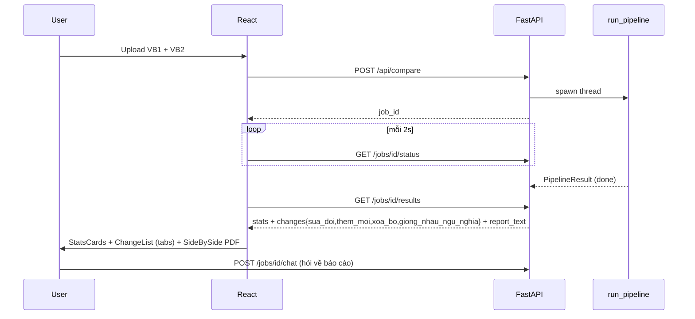

---

*Cập nhật: 2026-06-17*
