# Hệ thống So sánh Văn bản Pháp luật — Kiến trúc & Tổng hợp Thay đổi

> Tài liệu mô tả kiến trúc hiện tại của pipeline so sánh hai phiên bản văn bản pháp luật (VB1 cũ ↔ VB2 mới), cùng toàn bộ các fix/cải tiến đã thực hiện và kết quả kiểm thử.

---

## 1. Tổng quan

Hệ thống nhận **hai phiên bản** của một văn bản (hợp đồng, nghị định...) và tự động phát hiện, phân loại các thay đổi:

| Nhóm | Ý nghĩa |
|------|---------|
| `giong_nhau_hoan_toan` | Giống hệt (kể cả chỉ khác cách đánh số / paraphrase mà LLM coi là không đổi nghĩa) |
| `sua_doi` | Sửa đổi nội dung (đổi quyền/nghĩa vụ/số liệu...) |
| `them_moi` | Thêm mới ở VB2 |
| `xoa_bo` | Xóa khỏi VB1 |

**Kết quả** đi qua FastAPI → React frontend (tabs + side-by-side PDF + chat).

### Công nghệ
- **Embedding**: ONNX `Vietnamese_Embedding_v2` (local) hoặc API (`localhost:8001`)
- **Reranker**: `Vietnamese_Reranker` (local) hoặc API
- **Vector store**: ChromaDB (in-memory, tạo mới mỗi lần chạy)
- **LLM**: qwen3-next-80b (NVIDIA API) hoặc remote/Ollama — phân tích & tóm tắt thay đổi
- **Matching**: Greedy (vector+rerank) + Hungarian (scipy `linear_sum_assignment`)

---

## 2. Kiến trúc Pipeline (5 Phase)

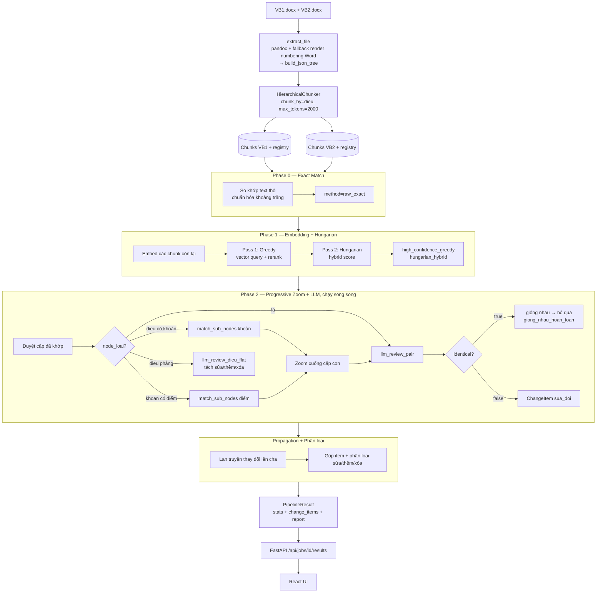

### Ngưỡng cấu hình ([configs/config.yaml](../configs/config.yaml))

| Tham số | Giá trị | Vai trò |
|---------|---------|---------|
| `max_tokens` | **2000** | Giới hạn token mỗi chunk (sát giới hạn embedding 2048) |
| `chunk_by` | `dieu` | Cấp chunk gốc |
| `distance_threshold` | 0.185 | Ngưỡng vector cho Greedy |
| `rerank_threshold` | 0.98 | Ngưỡng rerank cho Greedy |
| `hybrid_threshold` | 0.65 | Ngưỡng Hungarian chấp nhận khớp |

### Schema dữ liệu (Pydantic) — nguồn để vẽ lại Hình 3.2

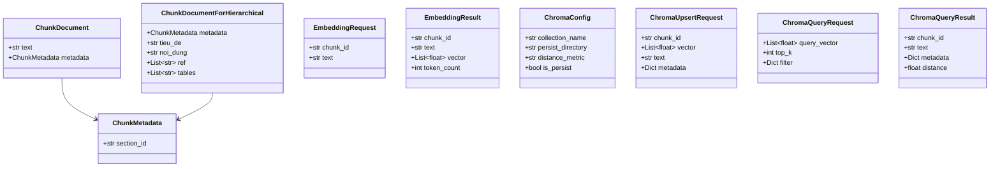
> So với Hình 3.2 hiện tại: bổ sung trường `tables: List[str]` trong `ChunkDocumentForHierarchical` (giữ HTML bảng để hiển thị trên UI).

---

## 3. Module `src/core/matching`

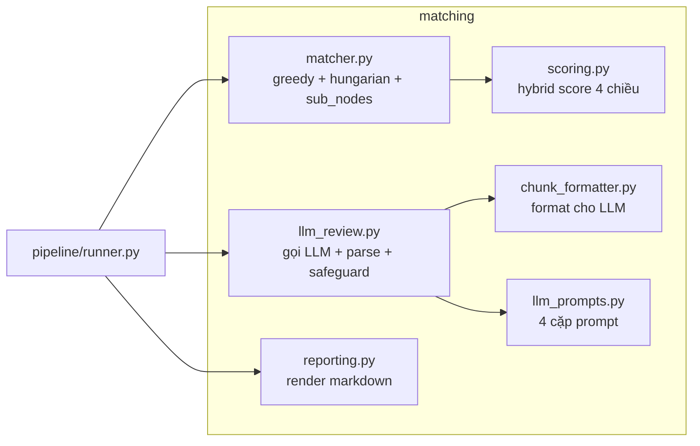

### 3.1. `scoring.py` — Hybrid Score

```
score = 0.35·s_embed + 0.15·s_title + 0.20·s_pos + 0.30·s_lex
        (nếu thiếu title: 0.50·s_embed + 0.20·s_pos + 0.30·s_lex)
```
- `s_embed`: cosine similarity vector
- `s_title`: fuzzy token-sort tên tiêu đề
- `s_pos`: tương đồng vị trí trong văn bản
- `s_lex`: Jaccard từ khóa (số, ngày, tên riêng)

### 3.2. `matcher.py`

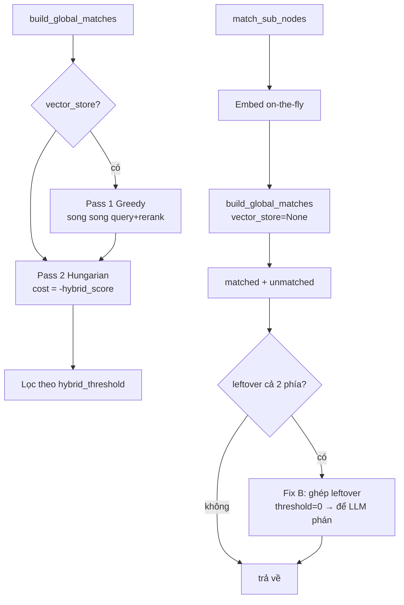

### 3.3. `llm_review.py` — luồng `llm_review_pair`

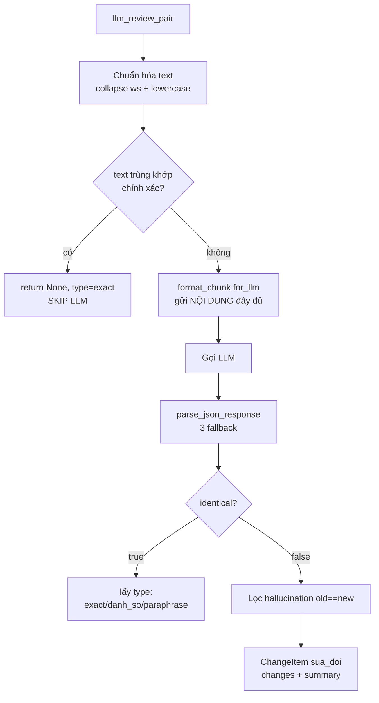

### 3.4. Bốn cặp prompt ([llm_prompts.py](../src/core/matching/llm_prompts.py))
- `PAIR_REVIEW_*`: so sánh cặp đã khớp → `identical` + `type` + `changes`
- `SINGLE_REVIEW_*`: tóm tắt chunk thêm/xóa đơn lẻ
- `KHOAN_WITH_DIEM_*`: phân tích Khoản kèm các Điểm con

---

## 4. Phân loại thay đổi (Taxonomy)

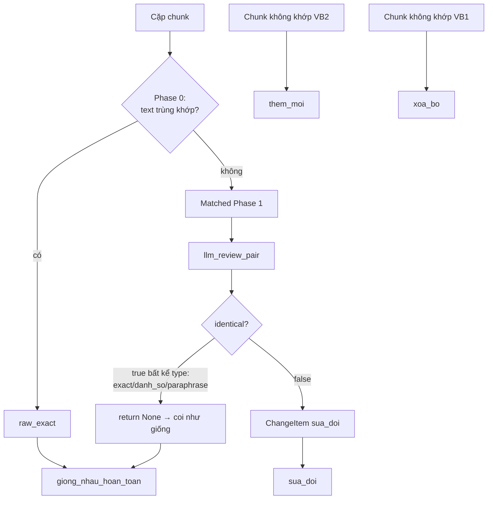

> **Thống nhất 3 nơi**: cả `runner.py` (report + stats) và `web/app.py` (UI) đều dùng `{llm_semantic_identical}` cho `giong_nhau_ngu_nghia` (trước đây lệch nhau).

---

## 5. Tổng hợp các Fix & Cải tiến (phiên này)

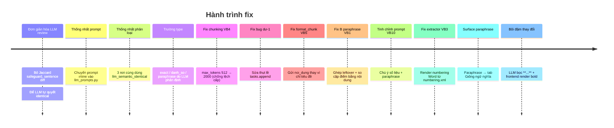

### 5.1. Bảng tổng hợp

| # | Fix | File | Vấn đề giải quyết |
|---|-----|------|-------------------|
| 1 | Đơn giản hóa `llm_review_pair` | [llm_review.py](../src/core/matching/llm_review.py) | Bỏ `get_critical_tokens`, `check_lexical_safeguard_jaccard`, `split_into_sentences_or_bullets`; để LLM quyết `identical` |
| 2 | Gom prompt | [llm_prompts.py](../src/core/matching/llm_prompts.py) | Prompt inline của `khoan_with_diem` chuyển vào file prompt |
| 3 | Thống nhất `giong_nhau_ngu_nghia` | [runner.py](../src/pipeline/runner.py), [web/app.py](../web/app.py) | 3 định nghĩa lệch nhau → cùng `{llm_semantic_identical}` |
| 4 | Trường `type` | [llm_prompts.py](../src/core/matching/llm_prompts.py), [llm_review.py](../src/core/matching/llm_review.py), [runner.py](../src/pipeline/runner.py) | LLM phân định exact / danh_so / paraphrase → tách "chỉ khác đánh số" khỏi paraphrase |
| 5 | **Chunking max_tokens 512→2000** | [config.yaml](../configs/config.yaml) | Cùng một Điều bị tách khoản ở bản này, giữ nguyên ở bản kia → matcher lệch cấp |
| 6 | **Fix bug "dư-1"** | [runner.py](../src/pipeline/runner.py) | `tasks.append` nằm NGOÀI vòng `for` → `chunk_d1` rò rỉ giữa các vòng → xóa_bo ma |
| 7 | **Fix `format_chunk`** | [chunk_formatter.py](../src/core/matching/chunk_formatter.py) | `for_llm=True` chỉ gửi `tieu_de` (tiêu đề) → mất thân → LLM tưởng giống nhau |
| 8 | **Fix B — paraphrase recall** | [matcher.py](../src/core/matching/matcher.py), [runner.py](../src/pipeline/runner.py) | Cặp điểm paraphrase bị ngưỡng loại → tách thành xóa+thêm |
| 9 | Tinh chỉnh prompt | [llm_prompts.py](../src/core/matching/llm_prompts.py) | Chú ý thay đổi nhỏ (phủ định/số/tình thái) + trích số liệu chính xác |
| 10 | **Fix extractor — render numbering Word** | [docx_extractor.py](../src/core/ingestion/docx_extractor.py) | Văn bản dùng numbered-list tự động của Word → pandoc làm mất số "Điều N" → parser không tách được Điều |
| 11 | ~~Surface paraphrase → ngu_nghia~~ **(ĐÃ GỠ)** | llm_review.py, runner.py, FE | Thử tách paraphrase ra tab riêng, nhưng LLM (qwen) phán nhầm thay đổi thật (vd xóa 1 câu) là "giống nghĩa" → GIẤU thay đổi. Đã gỡ tab "Giống ngữ nghĩa": mọi cặp LLM coi là giống đều bỏ qua, không tách riêng |
| 12 | **Bôi đậm từ thay đổi** | [llm_prompts.py](../src/core/matching/llm_prompts.py), [ResultsPage.jsx](../web/frontend/src/components/ResultsPage.jsx) | LLM bọc từ thay đổi bằng `**...**`; frontend `renderRich` render `<strong>` tô nổi bật |
| 13 | **Gỡ trường `type` / paraphrase khỏi LLM** | [llm_prompts.py](../src/core/matching/llm_prompts.py), [llm_review.py](../src/core/matching/llm_review.py), [runner.py](../src/pipeline/runner.py) | LLM chỉ còn trả `identical` true/false, không phân loại exact/danh_so/paraphrase nữa → đơn giản, mọi cặp "giống" → `giong_nhau_hoan_toan` |
| 14 | **Fix `section_id` Điều trùng giữa các Phần** | [legal_parser.py](../src/core/chunker/legal_parser.py) | VB nhiều Phần lặp "Điều 1..N" → trùng `dieu_N` → registry ghi đè + Phase 0 bỏ rơi chunk thứ hai (mất thay đổi thật). Dedup hậu tố `_2,_3...` |
| 15 | **Xử lý Điều phẳng (tách sửa/thêm/xóa)** | [llm_prompts.py](../src/core/matching/llm_prompts.py) (`FLAT_DIEU_*`), [llm_review.py](../src/core/matching/llm_review.py) (`llm_review_dieu_flat`), [runner.py](../src/pipeline/runner.py) | Điều không Khoản/Điểm: gộp mọi sửa thành 1 item nhưng TÁCH từng đoạn xóa/thêm thành item riêng → không nuốt các vế *Xóa* bên trong |
| 16 | **Bộ benchmark + chấm điểm tự động** | [benchmark/run_bench.py](../benchmark/run_bench.py), [benchmark/eval.py](../benchmark/eval.py) | Chạy pipeline trên 21 bộ VB, khớp item↔groundtruth theo vị trí Điều/Khoản/Điểm, tính Precision/Recall/F1 + Macro/Weighted, có log alignment kiểm chứng |

### 5.2. Chi tiết 3 fix quan trọng nhất

#### Fix #5 — Chunking lệch cấp (phát hiện ở VB4)
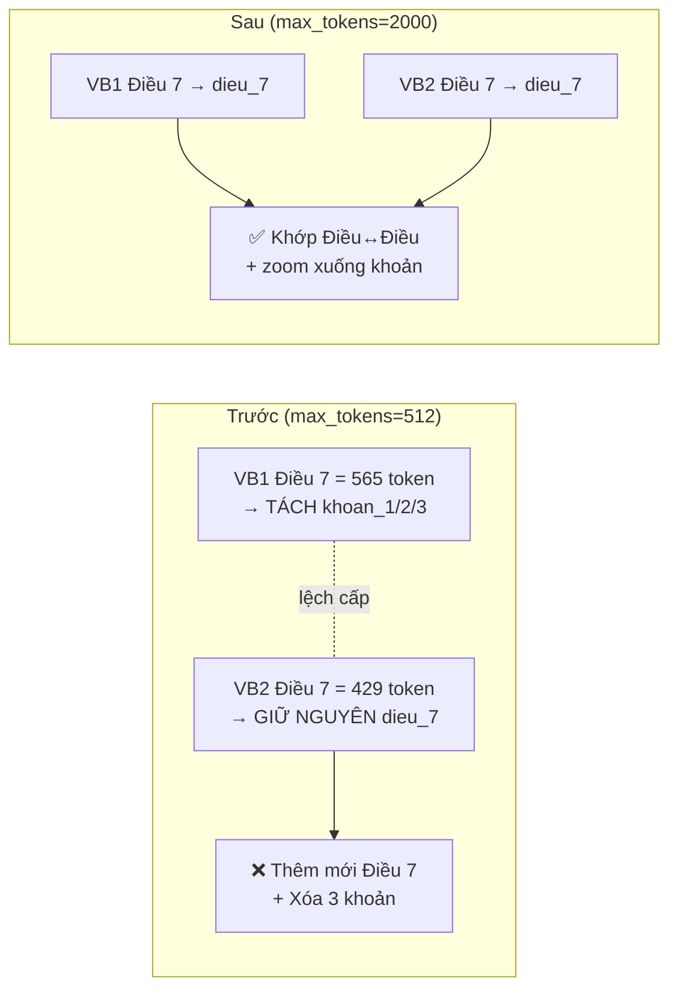
Điều > 2000 token (vd Điều 2: 2124/2253) vẫn tách khoản ở **cả hai** → đối xứng. Phase 2 vẫn zoom xuống khoản/điểm qua registry nên không mất độ chi tiết.

#### Fix #6 — Bug "dư-1" (thụt lề)
```python
# TRƯỚC (sai): tasks.append NGOÀI vòng for
for d1 in unmatched_diem_1:
    chunk_d1 = ChunkDocumentForHierarchical(...)   # ← bị overwrite/rò rỉ
tasks.append({"args": (chunk_d1, "xoa_bo"), ...})  # ← chạy 1 lần với chunk_d1 còn sót

# SAU (đúng): tasks.append TRONG vòng for
for d1 in unmatched_diem_1:
    chunk_d1 = ChunkDocumentForHierarchical(...)
    tasks.append({"args": (chunk_d1, "xoa_bo"), ...})
```
Khi `unmatched_diem_1` rỗng, dòng `tasks.append` cũ vẫn chạy với `chunk_d1` của vòng lặp trước → sinh `xoa_bo` ma (vd "Xóa điểm d Điều 2" với `VB2=dieu_5`).

#### Fix #7 — `format_chunk` nuốt nội dung (phát hiện ở VB5)
```python
# TRƯỚC: ưu tiên tieu_de (chỉ là "Điều 3. PHÍ DỊCH VỤ...") → mất bảng phí
noi_dung = chunk.tieu_de or chunk.noi_dung or "(trống)"
# SAU: ưu tiên noi_dung (thân đầy đủ)
noi_dung = chunk.noi_dung or chunk.tieu_de or "(trống)"
```
LLM trước đây chỉ nhận tiêu đề (giống nhau ở 2 bản) → phán "identical" → bỏ sót mọi thay đổi trong thân Điều phẳng.

#### Fix #8 — Fix B (paraphrase, phát hiện ở VB1)
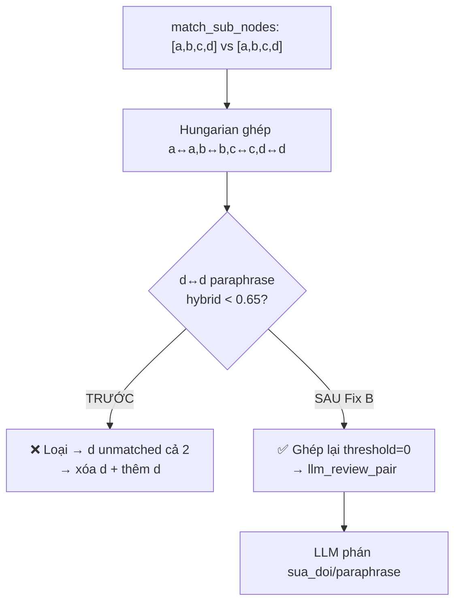
Đồng thời sửa runner: so cặp điểm đã khớp bằng **nội dung** (`cached_merged_text`), không phải `tieu_de` (với điểm chỉ là nhãn "Điểm a").

#### Fix #10 — Render numbering Word (phát hiện ở VB3)
Một số .docx đánh số "Điều 1, 2..." bằng **numbered-list tự động của Word** — số không nằm trong text mà do Word sinh khi hiển thị. Khi `docx → pandoc HTML → text`, số bị mất; parser không thấy "Điều N" → gom cả văn bản thành `modau_* + dieu_kho`.

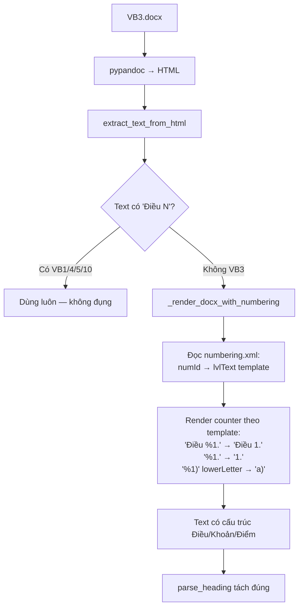

Cơ chế **fallback** (chỉ chạy khi text pandoc thiếu "Điều N") nên không ảnh hưởng các văn bản đang chạy tốt. Kết quả: VB3 từ 4 chunk dị thường (`dieu_kho`) → đúng `dieu_1..9`, phát hiện **9/9** thay đổi.

#### Fix #11 — Surface paraphrase vào tab "Giống ngữ nghĩa" — ⚠️ ĐÃ GỠ
> **Đã gỡ bỏ** theo quyết định của người dùng: qwen phán nhầm thay đổi thật (vd xóa 1 câu thông báo điện thoại ở VB2) là "giống nghĩa" → giấu mất thay đổi. Tab "Giống ngữ nghĩa" bị bỏ hoàn toàn; mọi cặp LLM coi là giống → bỏ qua. Mô tả dưới đây giữ lại để tham khảo thiết kế.

Trước đây cặp con (khoản/điểm) được LLM phán `identical + type=paraphrase` → `llm_review_pair` trả `None` → callback **vứt bỏ** → biến mất khỏi mọi tab.

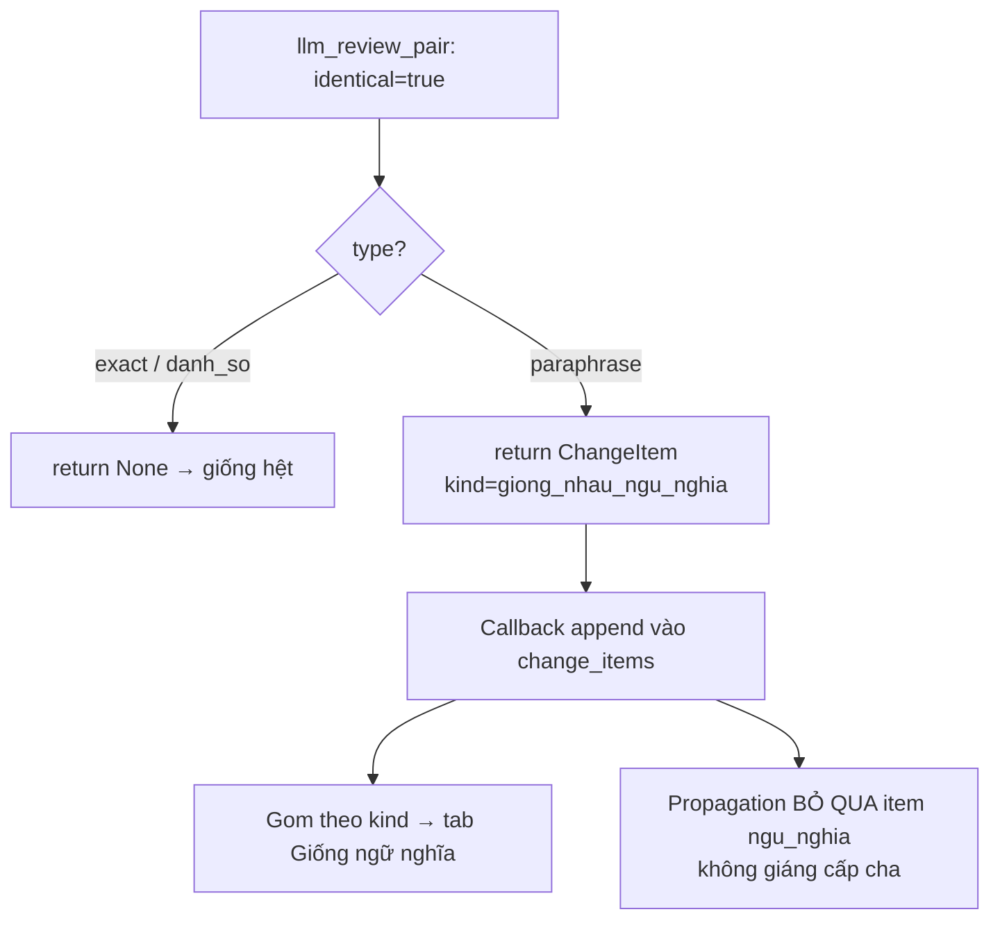

Kèm example paraphrase trong prompt để qwen chịu phát `type=paraphrase`. Kết quả: VB1 `dieu_21.khoan_3.diem_a` (gt #9) vào đúng tab (trước bị drop); không mất detection, không regress VB3/4/10.

#### Fix #12 — Bôi đậm từ/cụm từ thay đổi
Prompt yêu cầu LLM bọc phần thay đổi trong `old_content`/`new_content` bằng `**...**`. Frontend [ResultsPage.jsx](../web/frontend/src/components/ResultsPage.jsx) có helper `renderRich` tách `**...**` → `<strong>` tô xanh.

```
Cũ: ...mỗi ngày chậm thanh toán phải chịu **1%** giá trị...
Mới: ...mỗi ngày chậm thanh toán phải chịu **0,05%** giá trị...
```
Giúp người đọc thấy ngay chỗ khác biệt (số liệu, phủ định, động từ tình thái).

#### Fix #14 — `section_id` Điều trùng giữa các Phần (phát hiện ở VB1)
Văn bản nhiều **Phần** lặp lại "Điều 1..N" → parser gán cùng id `dieu_6` cho 2 Điều khác nhau. Hậu quả kép: (A) `build_node_registry` dùng `registry[id]=node` → node sau **ghi đè** node trước (mất nội dung); (B) `runner` Phase 0 theo dõi `matched_vb1/2` bằng **set section_id** → khi 1 bản `dieu_6` khớp, bản kia (chứa thay đổi thật) bị coi "đã khớp" rồi bỏ rơi.

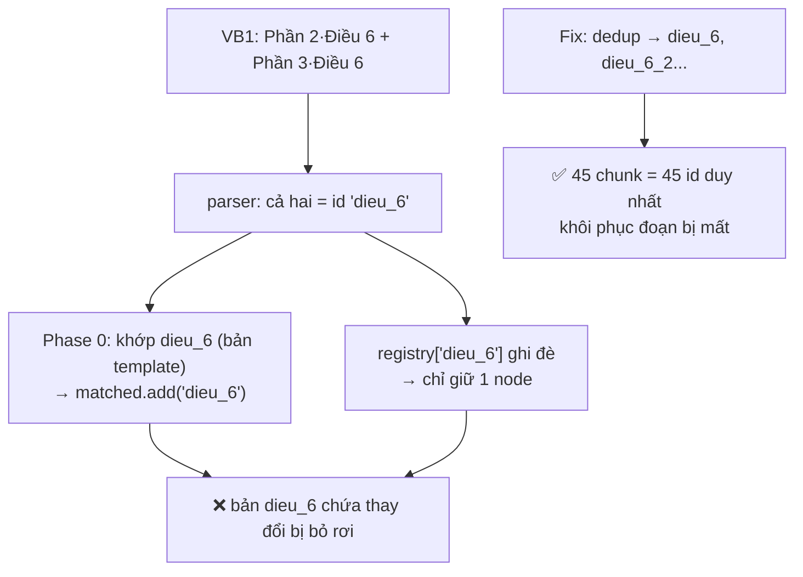
VB1: 45 chunk nhưng chỉ 31 id duy nhất (14 trùng). Sau fix → 45 id duy nhất; recall 0.64 → **0.82** (bắt được Điều 6.2 `[ĐKCT]`→`10%` và Điều 13.1.a `[ĐKCT]`→`4.950.000.000`). Vì id Khoản/Điểm có prefix `dieu_N` nên dedup tự cascade.

#### Fix #15 — Xử lý Điều phẳng, tách Xóa/Thêm (phát hiện ở VB5)
Điều phẳng (hợp đồng dịch vụ, không Khoản/Điểm) trước đây review cả Điều bằng `llm_review_pair` → LLM gộp thành 1 `sua_doi` và **nuốt các vế Xóa** bên trong. Thêm nhánh riêng:

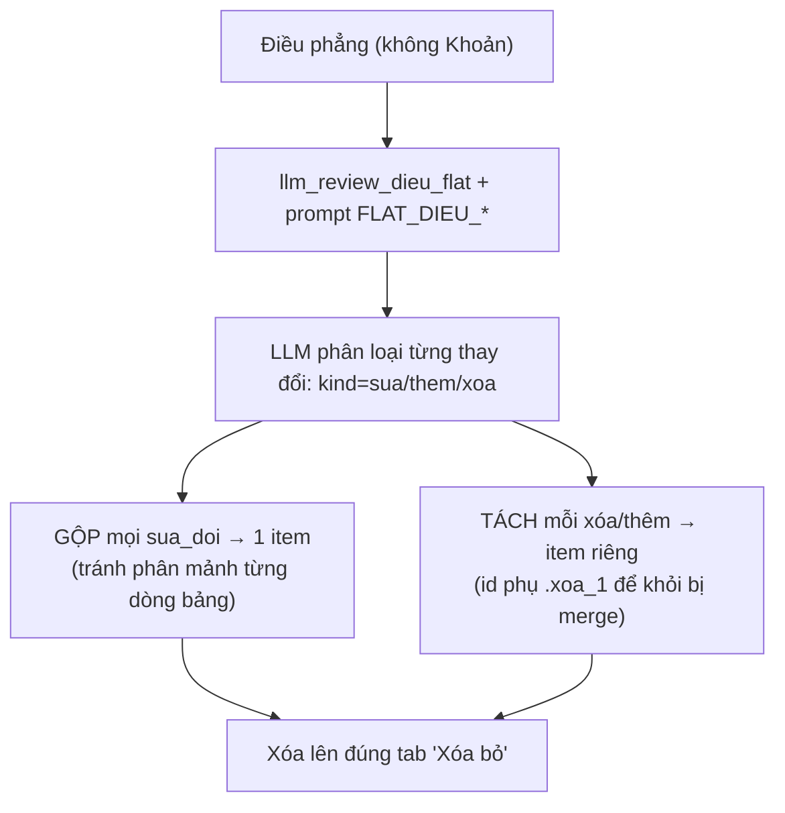
Chỉ áp dụng ở nhánh `cb_dieu_no_khoan` → **không đụng** luồng Khoản/Điểm. VB5: recall 0.25 → **0.75**, precision vẫn 0.86 (F1 0.36 → 0.80).

---

## 6. Kết quả Kiểm thử & Phương pháp đánh giá

### 6.1. Phương pháp tính metric
Bài toán là **phát hiện thay đổi** (detection). Khớp mỗi item hệ thống với một dòng groundtruth theo **vị trí Điều/Khoản/Điểm** (ưu tiên cùng loại sửa/thêm/xóa).

- **TP** = item khớp đúng vị trí một dòng GT · **FP** = item không khớp GT nào (= `số trả về − TP`) · **FN** = dòng GT không được khớp (= `tổng GT − TP`)
- **Precision** = TP/(TP+FP) · **Recall** = TP/(TP+FN) · **F1** = 2·P·R/(P+R) · báo cáo **Macro** (trung bình đều) và **Weighted** (theo số GT mỗi VB)
- **Không dùng Accuracy**: cần True Negative (cặp không đổi) — số này khổng lồ (vd VB01 có 36 cặp giống hệt) sẽ thổi phồng accuracy lên ~0.95+ dù recall thấp, gây hiểu sai.
- **Paraphrase trong groundtruth được tính là `sua_doi`** (theo quy ước hiện tại). Do LLM được cấu hình coi paraphrase = không đổi nghĩa, các dòng này thường bị tính **bỏ sót** → kéo recall xuống; đây là mâu thuẫn *thiết kế ↔ groundtruth* đã biết, không phải bug.

Công cụ: [benchmark/eval.py](../benchmark/eval.py) tự đọc groundtruth (chịu được nhiều layout cột), in bảng + log alignment từng dòng để kiểm chứng.

### 6.2. Kết quả 5 bộ đầu (qwen3-80b) — qua từng giai đoạn fix

| VB | Loại | F1 đầu phiên | Sau fix #14 (id trùng) | **Sau fix #15 (Điều phẳng)** |
|----|------|----|----|----|
| VB01 | HĐ tư vấn (đa Phần) | 0.78 | 0.90 | **0.90** (P=1.00 R=0.82) |
| VB02 | HĐ thi công | 0.67 | 0.80 | **0.80** (P=1.00 R=0.67) |
| VB03 | HĐ thế chấp | 1.00 | 1.00 | **1.00** |
| VB04 | HĐ mua bán điện | 1.00 | 1.00 | **1.00** |
| VB05 | HĐ SEO (Điều phẳng) | 0.36 | 0.36 | **0.80** (P=0.86 R=0.75) |
| **Macro F1** | | **0.76** | 0.81 | **0.90** |

```mermaid
xychart-beta
    title "F1 qua từng giai đoạn fix (5 bộ đầu)"
    x-axis ["VB01", "VB02", "VB03", "VB04", "VB05"]
    y-axis "F1" 0 --> 1
    bar [0.78, 0.67, 1.0, 1.0, 0.36]
    bar [0.90, 0.80, 1.0, 1.0, 0.80]
```
> Cột trái: đầu phiên — Cột phải: sau toàn bộ fix. Đặc trưng: precision rất cao (ít báo sai), recall bị giới hạn bởi paraphrase (chủ ý tắt) và một số ca Điều phẳng/đa Khoản.

### 6.3. Kết quả đầy đủ 21 bộ (qwen3-next-80B, temp=0 — tái lập được)

Khớp item↔groundtruth bằng **vị trí + độ trùng nội dung** (token overlap) — chịu được groundtruth không ghi rõ "Điều N". VB12–13 đầu vào là **PDF**; VB14–21 dùng quy ước `<tên>.docx` (gốc) + `<tên>-sua-doi.docx`. VB15 groundtruth ở dạng văn xuôi (.txt) → đã chuyển thành `VB15_gt.xlsx` (7 thay đổi) để chấm tự động. **temp=0** nên kết quả tất định, chạy lại không đổi.

| VB | GT | TP | FP | FN | P | R | F1 |
|----|----|----|----|----|----|----|----|
| VB01 | 11 | 9 | 0 | 2 | 1.00 | 0.82 | 0.90 |
| VB02 | 9 | 6 | 0 | 3 | 1.00 | 0.67 | 0.80 |
| VB03 | 9 | 9 | 0 | 0 | 1.00 | 1.00 | 1.00 |
| VB04 | 9 | 9 | 0 | 0 | 1.00 | 1.00 | 1.00 |
| VB05 | 8 | 7 | 0 | 1 | 1.00 | 0.88 | 0.93 |
| VB06 | 8 | 6 | 0 | 2 | 1.00 | 0.75 | 0.86 |
| VB07 | 9 | 5 | 0 | 4 | 1.00 | 0.56 | 0.71 |
| VB08 | 5 | 5 | 2 | 0 | 0.71 | 1.00 | 0.83 |
| VB09 | 8 | 7 | 0 | 1 | 1.00 | 0.88 | 0.93 |
| VB10 | 9 | 9 | 0 | 0 | 1.00 | 1.00 | 1.00 |
| VB11 | 5 | 5 | 0 | 0 | 1.00 | 1.00 | 1.00 |
| VB12 (PDF) | 7 | 6 | 1 | 1 | 0.86 | 0.86 | 0.86 |
| VB13 (PDF) | 8 | 8 | 3 | 0 | 0.73 | 1.00 | 0.84 |
| VB14 | 6 | 6 | 2 | 0 | 0.75 | 1.00 | 0.86 |
| VB15 | 7 | 6 | 0 | 1 | 1.00 | 0.86 | 0.92 |
| VB16 | 6 | 6 | 6 | 0 | 0.50 | 1.00 | 0.67 |
| VB17 | 7 | 7 | 1 | 0 | 0.88 | 1.00 | 0.93 |
| VB18 | 9 | 8 | 0 | 1 | 1.00 | 0.89 | 0.94 |
| VB19 | 10 | 9 | 2 | 1 | 0.82 | 0.90 | 0.86 |
| VB20 | 6 | 5 | 1 | 1 | 0.83 | 0.83 | 0.83 |
| VB21 | 5 | 5 | 0 | 0 | 1.00 | 1.00 | 1.00 |
| **Macro (21 VB)** | | | | | **0.91** | **0.90** | **0.89** |
| **Weighted (theo GT)** | | | | | **0.92** | **0.89** | **0.89** |

**Nhận xét:**
- **Precision cao** (Macro 0.91): hệ thống ít báo sai. Các ca FP chủ yếu là **over-detection** — bắt thêm thay đổi mà groundtruth không liệt kê, hoặc nhánh Điều phẳng tách một đoạn viết-lại thành xóa+thêm (vd VB16 `dieu_5`). Với công cụ diff pháp lý, báo dư an toàn hơn bỏ sót.
- **Recall cao** (Macro 0.90). Các ca recall thấp: VB07 (0.56 — nhiều thay đổi ở Điểm đánh số La Mã `i/ii/xii` mà parser chưa tách), VB02 (0.67 — paraphrase + xóa câu lẫn trong Khoản dài).
- So với bảng tham chiếu ban đầu (Macro P=0.76 R=0.83 F1=0.78), kết quả hiện tại **P=0.91 R=0.90 F1=0.89**.

> **Lưu ý về tính tái lập:** chạy ở `temperature=0`. Ở `temperature=0.5` các con số dao động ±0.03–0.04 mỗi lần do tính ngẫu nhiên của LLM.

### 6.4. So sánh model & tối ưu tốc độ
- **Model:** qwen3-next-80B (temp=0) đạt **F1 0.89** ổn định. Các model nhỏ (vd 8B) cho recall tương đương nhưng **over-detect nhiều hơn** → precision và F1 thấp hơn, số liệu kém ổn định.
- **Tốc độ:** Phase 2 (zoom-in Điều→Khoản→Điểm) được **chạy song song** + **batch embedding** (gom toàn bộ Khoản/Điểm embed 1 lời gọi API thay vì ~46) → mỗi văn bản từ ~112s xuống **~37s** (nhanh ~3×), phần lớn dưới 40s.

---

## 7. Hạn chế còn lại

| Hạn chế | Bản chất | Hướng xử lý |
|---------|----------|-------------|
| Summary sai số lẻ (vd "04 năm" → "0 năm") | Model qwen sinh nhầm chữ; phân loại vẫn đúng | UI hiển thị excerpt thật cạnh nhau; có thể thêm hậu kiểm số liệu |
| LLM phán nhầm "giống" cho thay đổi thật | qwen đôi khi coi việc xóa/thêm 1 câu là "giống nghĩa" → cặp đó bị bỏ qua (không hiện thành sửa đổi) | Đã gỡ tab paraphrase (tránh hiển thị sai); nhưng cặp bị LLM phán nhầm vẫn có thể bị bỏ sót — guard difflib là phương án nếu cần tăng recall |
| ~~Điều phẳng gộp thêm/xóa~~ **(ĐÃ FIX #15)** | Thêm/xóa trong Điều phẳng bị gộp thành 1 `sua_doi` | Đã tách qua `llm_review_dieu_flat`; còn lại: LLM thỉnh thoảng sót 1 vế xóa khi nhiều đoạn xóa nằm sát nhau |
| Paraphrase ↔ groundtruth | LLM coi paraphrase = không đổi nghĩa (chủ ý tắt), nhưng groundtruth tính là `sua_doi` → trừ recall | Quyết định thiết kế; nếu muốn bắt paraphrase phải bật lại — đánh đổi nguy cơ giấu thay đổi thật |
| Điều > 2048 token | Vượt giới hạn embedding | Tách khoản (đã có); cân nhắc đồng bộ granularity 2 bản |
| eval under-count khi GT không ghi "Điều N" | Dòng groundtruth chỉ ghi nội dung, không nêu vị trí Điều → bộ chấm không trích được vị trí | Hạn chế của công cụ chấm, không phải pipeline; bổ sung cột "Vị trí" trong groundtruth sẽ khắc phục |
| Fallback numbering chưa xử lý bảng | `_render_docx_with_numbering` chỉ render text + numbering, chưa flatten bảng như pandoc | Văn bản vừa dùng Word-numbering vừa có bảng có thể mất bảng (hiếm) |

---

## 8. Luồng dữ liệu Backend → Frontend

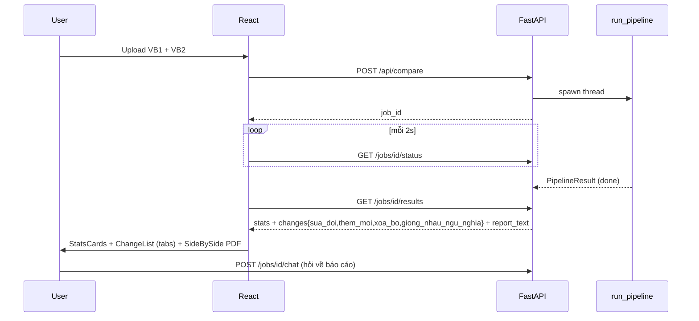

---

*Cập nhật: 2026-06-18 — fix #13–16 + fix đánh số đa cấp; đánh giá 21 VB ở temp=0 (qwen3-next-80B, Macro F1 0.89, tái lập được); tối ưu Phase 2 song song + batch embedding (~3× nhanh hơn).*
