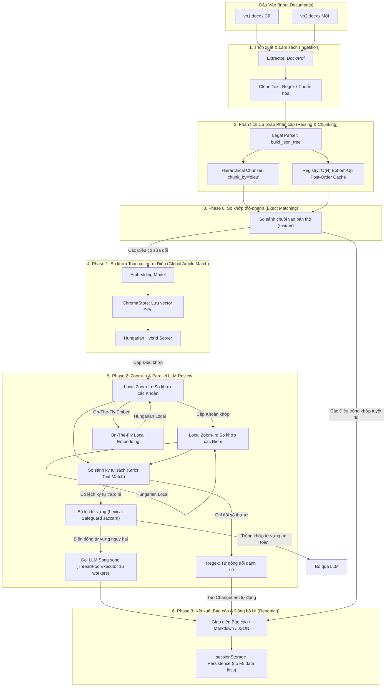

# Tài liệu Kiến trúc & Luồng xử lý Hệ thống (System Pipeline Walkthrough)

Tài liệu này mô tả chi tiết toàn bộ kiến trúc, các khối chức năng, và luồng xử lý đầu-cuối (end-to-end pipeline) tối ưu của dự án **`legal-doc-diff-rag`** — Hệ thống so khớp, phát hiện thay đổi và phân tích tác động pháp lý tự động cho văn bản pháp luật Việt Nam.

---

## 1. Sơ đồ Luồng Xử lý Tổng quan (Architecture Flow)

---

## 2. Chi tiết các Khối Chức năng (Core Modules)

### 2.1. Khối Ingestion (Trích xuất & Làm sạch)
* **Tệp tin**: [`extractor.py`](../src/core/ingestion/extractor.py), [`docx_extractor.py`](../src/core/ingestion/docx_extractor.py), [`text_cleaner.py`](../src/core/ingestion/text_cleaner.py).
* **Nhiệm vụ**:
  * Tự động nhận diện định dạng tệp đầu vào (`.docx` hoặc `.pdf`) để áp dụng bộ trích xuất tương ứng.
  * Làm sạch văn bản thô: Loại bỏ khoảng trắng thừa, chuẩn hóa dấu câu tiếng Việt, và chuẩn hóa cấu trúc phân đoạn thô để chuẩn bị cho bước phân tích ngữ nghĩa.

### 2.2. Khối Parsing & Chunking (Dựng Cây Pháp Luật Phân cấp)
* **Tệp tin**: [`legal_parser.py`](../src/core/chunker/legal_parser.py), [`hierarchical.py`](../src/core/chunker/hierarchical.py).
* **Nhiệm vụ**:
  * **`build_json_tree`**: Dùng cấu trúc Regex phức tạp phân tích văn bản pháp luật Việt Nam thành cấu trúc cây JSON phân cấp: `Mở đầu / Điều → Khoản → Điểm`, kèm bóc tách tham chiếu chéo thông minh (xử lý được "Điều này").
  * **Registry Bottom-Up ($O(N)$ Complexity)**: Sử dụng giải thuật duyệt hậu thứ tự (Post-order Traversal) đi từ dưới lên. Mỗi node trong cây chỉ được duyệt qua đúng **1 lần duy nhất**:
    * Tổng hợp và cache sẵn toàn văn gộp của node cùng tất cả các con cháu trực thuộc (`cached_merged_text`).
    * Bóc tách và cache sẵn tập từ khóa Jaccard (`cached_keywords`) của node để tăng tốc độ tính toán ma trận.
  * **`HierarchicalChunker`**: Trích xuất các đơn vị chunk pháp lý đại diện (mặc định trích xuất cấp Điều - `"dieu"`) để nạp vào cơ sở dữ liệu vector.

### 2.3. Khối Vector Store & Retrieval (Lưu trữ và Truy vấn)
* **Tệp tin**: [`chroma_store.py`](../src/core/vector_store/chroma_store.py), [`retrieval.py`](../src/core/retrieval/retrieval.py).
* **Nhiệm vụ**:
  * **ChromaDB**: Chỉ lưu trữ vector biểu diễn ngữ nghĩa của các đơn vị Điều gốc.
  * **Tra cứu Ngược $O(1)$**: Khi nhận kết quả truy vấn từ DB, hệ thống lập tức ánh xạ ngược lại cấu trúc cây JSON của Điều thông qua ID trong Registry phẳng, loại bỏ hoàn toàn các vòng lặp quét đắt đỏ.

### 2.4. Khối Tính điểm và So khớp Hungarian (Matching Engine)
* **Tệp tin**: [`matcher.py`](../src/core/matching/matcher.py), [`scoring.py`](../src/core/matching/scoring.py).
* **Nhiệm vụ**:
  * **`calculate_hybrid_score`**: Tính toán điểm số kết hợp (Hybrid Score) giữa hai node pháp luật dựa trên 4 thành phần có trọng số:
    1. *Cosine Similarity* (Ngữ nghĩa vector) — 35% (hoặc 50% nếu không có tiêu đề).
    2. *Title Fuzzy Similarity* (So khớp mờ tiêu đề bằng `thefuzz`) — 15%.
    3. *Positional Bias* (Vị trí tương đối của Điều trong văn bản) — 20%.
    4. *Jaccard Similarity* (Trùng khớp từ khóa pháp lý đã cache) — 30%.
  * **Hungarian Algorithm**: Giải bài toán phân công tối ưu toàn cục (Global Assignment Problem) trên RAM bằng thư viện `scipy.optimize.linear_sum_assignment` để ghép cặp các Điều từ VB2 sang VB1 với tổng điểm tương đồng lớn nhất.

### 2.5. Khối Đánh giá & Phân tích LLM Song song (Parallel LLM Engine)
* **Tệp tin**: [`llm_review.py`](../src/core/matching/llm_review.py), [`llm_prompts.py`](../src/core/matching/llm_prompts.py), [`runner.py`](../src/pipeline/runner.py).
* **Nhiệm vụ**:
  * **Tối ưu hóa Thực thi Song song (Parallel Execution)**: Sử dụng mô hình xử lý không đồng bộ kết hợp với `ThreadPoolExecutor` cấu hình 16 luồng song song (`max_workers=16`) để thực hiện đồng loạt nhiều cuộc gọi LLM thay vì gọi tuần tự, giúp rút ngắn tối đa thời gian chờ đợi.
  * **Bộ lọc Từ vựng (Lexical Safeguard)**: Kiểm tra chênh lệch từ vựng mang tính cốt lõi (số liệu, ngày tháng, từ khóa phủ định/bắt buộc như *"không"*, *"phải"*, *"được"*, *"cấm"*) dựa trên chỉ số tương đồng Jaccard. Nếu không phát hiện biến động từ vựng nguy hiểm này, cuộc gọi LLM sẽ tự động bị bỏ qua nhằm tối ưu chi phí API.
  * **Tự động Phát hiện Đổi Đánh số (Automatic Numbering-only Diff)**: Sử dụng các regex phân tách tiền tố thứ tự để bóc tách nội dung của các Khoản. Nếu nội dung hoàn toàn giữ nguyên và chỉ thay đổi số thứ tự (ví dụ: *Khoản 1* thành *Khoản 2*), hệ thống tự động sinh báo cáo kỹ thuật mà không cần truy vấn LLM.

---

## 3. Hành trình Luồng Xử lý 4 Phase Đầu - Cuối

### Phase 0: So khớp thô nhanh (Raw Exact Matching)
* **Mục tiêu**: Lọc ra các Điều hoàn toàn giống nhau 100% về mặt ký tự thô giữa VB1 và VB2.
* **Cách hoạt động**:
  * Tạo bảng băm chuỗi văn bản thô của các Điều thuộc VB1.
  * Quét nhanh qua các Điều của VB2. Nếu trùng khớp chuỗi tuyệt đối, hệ thống ghi nhận ngay là cặp khớp chính xác (`raw_exact`) và loại bỏ cặp này ra khỏi các giai đoạn xử lý vector/LLM tiếp theo để tiết kiệm tài nguyên tối đa.

### Phase 1: So khớp Toàn cục cấp Điều (Global Matching)
* **Mục tiêu**: Ghép cặp các Điều có sửa đổi, biến đổi, hoặc paraphrase giữa hai văn bản.
* **Cách hoạt động**:
  * Nhúng vector các Điều còn lại của VB1 và đẩy vào ChromaDB làm chỉ mục tìm kiếm.
  * Quét qua các Điều còn lại của VB2:
    * **Pass 1 (Greedy)**: Truy vấn Top-$K$ ứng viên tương đồng nhất từ ChromaDB và Rerank để khớp nhanh các cặp có độ tin cậy cực cao.
    * **Pass 2 (Hungarian)**: Dựng ma trận điểm kết hợp (Hybrid Matrix) giữa các Điều còn lại của VB2 và VB1. Sử dụng giải thuật Hungarian giải tối ưu toàn cục để tìm ra các cặp Điều sửa đổi có điểm trùng khớp vượt ngưỡng `HYBRID_THRESHOLD` (mặc định `0.75`).

### Phase 2: Progressive Zoom-In & Unified Parallel LLM Review
* **Mục tiêu**: Đi sâu vào cấu trúc nội bộ của từng cặp Điều đã khớp để tìm ra các Khoản/Điểm bị sửa đổi, thêm mới, hoặc xóa bỏ, sau đó gửi ngữ cảnh gộp lên LLM phân tích song song.
* **Cách hoạt động**:
  * **Zoom-In cấp 1 (Khoản)**: Trích xuất các Khoản thuộc Điều VB1 và Điều VB2. Chạy hàm `match_sub_nodes`.
    * *On-The-Fly Embedding*: Sinh vector tức thời trong bộ nhớ RAM bằng mô hình nhúng cục bộ cho các Khoản để tính toán tương đồng ngữ nghĩa.
    * Ghép cặp các Khoản bằng giải thuật Hungarian.
  * **Zoom-In cấp 2 (Điểm)**: Đối với mỗi cặp Khoản đã khớp, tiếp tục lấy ra danh sách các Điểm con trực thuộc và chạy `match_sub_nodes` để khớp Điểm.
  * **Cơ chế Tiết kiệm & Tối ưu hóa API LLM**:
    * **So sánh văn bản chuẩn hóa nghiêm ngặt (Strict Text Match)**: Loại bỏ các cặp Khoản/Điểm trùng khớp ký tự 100% ra khỏi ngữ cảnh gửi đi. Nếu toàn bộ nội dung của Điều không có biến động, bỏ qua cuộc gọi LLM hoàn toàn.
    * **Automatic Numbering Diff**: Tự động bóc tách tiền tố đánh số bằng Regex. Nếu chỉ khác biệt về chỉ số đánh thứ tự kỹ thuật (như *Khoản 3.1* thành *Khoản 3.2*) mà nội dung điều khoản hoàn toàn giữ nguyên, hệ thống lập tức xuất ra `ChangeItem` đánh số tự động (`automatic_numbering_diff`) và không gửi lên LLM.
    * **Lexical Safeguard Jaccard**: Với các cặp khớp có độ tin cậy cao, nếu kiểm tra Jaccard trên tập từ khóa pháp lý cốt lõi và số liệu đạt 1.0 (không có thay đổi nguy hại), hệ thống bỏ qua cuộc gọi LLM.
  * **Lập lịch và Thực thi Gọi LLM Song song (Parallelism)**:
    * Thay vì gọi LLM tuần tự cho từng khoản/điểm thay đổi gây nghẽn cổ chai, hệ thống thu thập và lập lịch đồng loạt cho tất cả các tác vụ:
      - `llm_review_pair` cho cặp Điều/Khoản sửa đổi riêng lẻ hoặc nội dung giới thiệu của Điều.
      - `llm_review_single` cho Khoản/Điểm được thêm mới hoặc xóa bỏ (sử dụng bối cảnh phân cấp đầy đủ dựng bằng `get_node_context`).
      - `llm_review_khoan_with_diem` cho việc phân tích gộp Khoản kèm theo toàn bộ sự thay đổi ở các Điểm trực thuộc.
    * Hệ thống kích hoạt đồng thời tối đa **16 luồng song song** (`ThreadPoolExecutor(max_workers=16)`) tích hợp với event loop async để gửi đồng loạt các request lên LLM Server, đẩy tốc độ xử lý nhanh gấp 10-15 lần.
  * **Tinh chỉnh Prompt và Tóm tắt Chuẩn hóa**:
    * Prompt của LLM được cải tiến sâu để tóm tắt thông minh hơn, yêu cầu LLM trích xuất trường "Mã đoạn" (ví dụ: *Điều 5, Khoản 2*) để chèn trực tiếp vào đầu phần tóm tắt (`summary`).
    * Loại bỏ các phân cấp mức độ thay đổi dư thừa (severe/minor) trước đó, giữ cấu trúc JSON đầu ra sạch sẽ và chuẩn xác.
    * Áp dụng thuật toán **Lan truyền ngược trạng thái thay đổi (Propagation)**: Nếu một phần tử con (Điểm) bị biến động thực tế, trạng thái sửa đổi sẽ tự động lan truyền ngược lên các node cha (Khoản, Điều) chứa nó để đồng bộ hóa giao diện và logic phân tích.